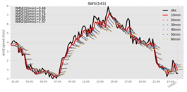
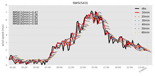
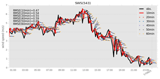

2017년 한국해양학회 추계학술대회 김동훈, 우승범 (인하대학교)

# 서론

기상관측장비로부터 수신되는 관측자료들은 운영의 복잡함에 따라 지연수신이 되는 경우가 발생함으로써 관측지점이 많아 질수록 모든 자료가 수신되는 데에는 그 만큼 지연시간이 커지게 된다. 그러므로 기준시간을 넘어서 미수신되는 관측자료를 대체할 수 있다면 여러 가지로 큰 의미를 부여할 수 있을 것이다. 예를들어, 기상예측 성능에 가장 큰 영향을 미치는 자료동화에 있어서 미수신되는 관측자료를 대신하여 자료동화의 품질 향상에 기여할 수 있으며, 수신된 관측자료의 1차 품질관리에도 사용 될 수 있을 것이다. 또한, 바람 관측자료의 10분에서 60분 내의 미래 관측치를 예측한다는 것은 항공기 이착륙과 같은 초단기 예측이 필요한 분야에서 큰 의미를 가질 수 있다.

기상청에서는 레이더 자료와 위성 자료 등을 이용한 실황 또는 초단기 예측 시스템을 개발하여 예보에 사용하고 있다. 이 예측 시스템들은 기본적으로 내·외삽 방법을 기반으로 하고 있으며, 좀 더 선진방법으로 초단기 순환모형을 사용하는 경우도 있지만 우리나라와 같이 국지적으로 짧은 시간에 발생 또는 소멸되는 기상 시스템에는 예측성능을 높이는데 어려움을 겪고 있다. 따라서, 본 연구에서는 그 동안의 개발 방법과는 다른 인공신경망 딥러닝을 이용한 초단기 예측의 가능성을 진단해 보았다.

# 예측방법 및 자료

딥러닝(Deep Learning) 방법 중에서 시계열 예측에 적합한 순환신경망(Recurrent Neural Networks, RNN)을 사용하여 예측시스템을 개발하였다. 특히 RNN의 방법 중에서 장기 기억을 잘 반영할 수 있는 GRU 방법을 사용하였다.

RNN-GRU는 입력층과 은닉(hidden)층, 출력층으로 구성되는데 입력층에 필요한 입력자료는 기상청에서 운영하고 있는 자동기상관측장비(Automated Weather  Station, AWS)의 관측자료를 사용하였다. AWS는 1분 단위로 지상의 풍속과 풍향, 기온, 강수량 등을 관측하여 실시간으로 제공하는데, 개발된 딥러닝 모델이 10분 단위로 예측하기 편리하도록 시계열 자료를 10분 평균으로 재구성하여 사용하였다.

본 연구에서 실험한 예측 지점은 인천공항에서 가까운 영종도 지점(지점번호:543)이며, 이 지점을 포함한 주위의 10개 AWS 관측 지점들의 관측 자료(풍속,풍향,기온,강수량)를 예측인자로 사용하였다(그림 1).

그림 1. 예측 지점인 영종도 지점(543)을 포함한 주위 10개의 AWS 관측 지점

온라인에서 제공받을 수 있는 자료의 한계로 딥러닝 모델의 학습에 사용한 자료는 2016년 1월1일 00시00분부터 1년간인 2016년 12월 31일 23시59분까지의 자료를 사용하였다. 10분 단위의 1년간 학습기간은 지점 당 하나의 변수가 5만개가 넘기 때문에 자료의 양은 많으나 그 기간이 충분치 않은 면이 있다. 그러나 2016년과 2017년의 기후가 크게 다르지 않다는 가정하에 2016년으로 학습한 모델을 가지고 2017년의 특정일에 대하여 예측해 보았다. 2017년 1월부터 8월까지의 기간 중 인천지역의 최대 풍속이 발생하였던 2017년 1월26~27일과 5월6일, 5월13일, 8월24일에 대하여 각각 예측을 시도하였다.

초단기 풍속 예측모델은 사용하는 자료가 지상으로 한정되어 있으므로 10분 이상의 예측에는 한계가 있을 것으로 예상되어 관측치의 10분 후 예측을 주요 목표로 삼았으나 확장 가능성을 진단하기 위하여 20분부터 60분까지의 예측도 함께 실시하였다.

# 결과

2017년 1월부터 현재(8월)까지 영종도 지점의 순간풍속이 7∼8 m/s에 달하였던 1월 26~27일과 5월 6일, 5월 13일, 8월 24일에 대하여 각각 실제 관측자료와 예측 자료를 비교하여 보았다(그림 2∼5).

 그림 2. 사례1: 2017년 1월 26~27일

 그림 3. 사례2: 2017년 5월 6일

 그림 4. 사례3: 2017년 5월 13일

그림 5. 사례4: 2017년 8월 24일

검은 실선은 AWS 관측치이며, 매 10분마다 그려진 짧은 실선과 점들은 각 해당분에서의 60분까지의 예측을 나타낸다. 붉은 실선은 매 10분마다 10분 후의 관측치를 예측한 결과를 이은 선이다.

관측 시각으로부터 10분 예측의 경우는 평균제곱오차가 각각 0.51(1월26~27일), 0.48(5월6일), 0.47(5월13일), 0.47(8월24일)로 나타났으나, 60분으로 갈수록 예측성능은 급격히 떨어지는 것으로 나타났다. 주위의 20km 내외의 지상바람과 기온, 강수량 만으로 60분 후의 바람을 예측한다는 것은 일반적으로 어려운 것으로 예상할 수 있으며, 지상 자료 뿐만 아니라 상층의 관측자료와 함께 딥러닝 모델을 훈련시키면 좀 더 예측성능을 높일 수 있을 것으로 판단된다. 그럼에도 불구하고 10~20분 예측 결과는 상당히 고무적으로 나타나고 있어서 초단기 예측에의 활용 가능성은 높다고 할 수 있다.

# 결론

본 연구에서는 딥러닝을 이용하여 영종도의 AWS 관측지점에 대하여 10분에서 60분 후의 관측치를 예측해 보았다. 지상에 한정된 관측자료와 훈련에 사용할 자료의 기간이 1년간이라는 단점으로 40~60분 후의 예측성능은 높지 않지만, 10~20분 후의 예측은 활용하기에 충분한 성능을 보여 주었다. 특히, 딥러닝 모델은 학습과정에서 고성능 컴퓨터와 많은 계산시간이 걸리지만, 학습이 완료된 모델을 사용한 예측 시에는 개인용 컴퓨터로도 순식간에 결과를 도출할 수 있는 장점이 있으므로 실제 응용 가능성이 매우 높다고 할 수 있다.