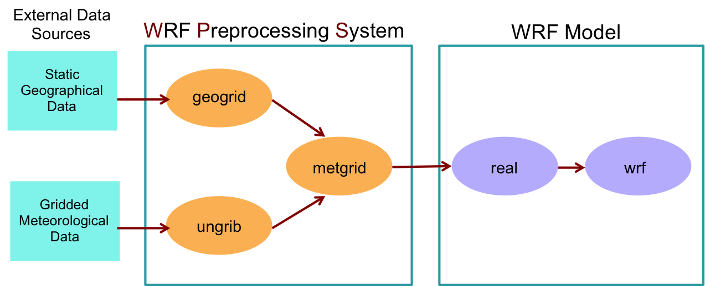
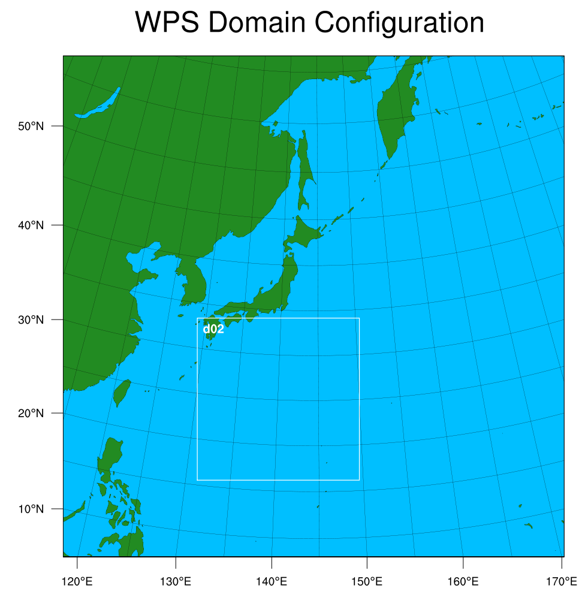
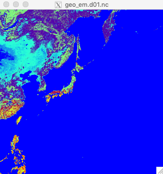

<p style="text-align:right">작성 : 김동훈 (<a href="http://blog.dhkim.info">http://blog.dhkim.info</a>, 인하대학교)<br/> 
& 문일주 (제주대학교)<br/>2019년 4월 29일</p>

---


WRF (Weather Research and Forecasting) 모델(모형)의 설치 및 실험에 관한 상세한 내용은
[온라인 튜포리얼](http://www2.mmm.ucar.edu/wrf/OnLineTutorial/index.php)에 잘 설명되어 있으므로 영어에 친숙하신 분이라면 [here](http://www2.mmm.ucar.edu/wrf/OnLineTutorial/index.php)를 참고하세요.

여기에서는 **태풍 솔릭(Soulik)을 대상**으로 설명하며, 최신 버전인 **WRF V4.1** (2019년 4월 12일 배포)을 사용합니다.
***절의 제목 앞에 숫자****가 붙어 있는 부분은 사용자가 직접 실행해야 하는 부분을 의미합니다.*


## 소 개

WRF 모델(모형)은 주요 역학 구현에 따라 두 가지로 모델이 나뉘어 집니다. 
NCEP에서 개발한 Non-hydrostatic Mesoscale Model (**NMM**)과 
NCAR에서 개발한 Advanced Research WRF (**ARW**)가 있습니다.
여기에서는 일반적으로 연구에 많이 사용하고 있는 WRF-ARW를 대상으로 설명합니다.

WRF-ARW 모델은 압축성이며 비정수압(옵션으로 정수압을 지원함) 모델 입니다. V4.0 부터 기본 연직 좌표계는 mass-based hybrid sigma-pressure vertical coordinate 를 사용합니다. 참고로, V4.0 이전에는 mass-based terrain-following hydrostatic pressure coordinate)를 사용하였습니다. 수평 좌표계는 Arakawa C-grid 를 사용합니다.

WRF-ARW 모델은 다음과 같이 4종류의 실행가능한 파일이 있습니다.

* ideal.exe 및 real.exe : 초기화 프로그램 
* wrf.exe : 모델의 실제 적분 
* ndown.exe : one-way nesting에 사용
* tc.exe : 태풍이나 허리케인 같은 열대성 저기압의 추가 또는 제거에 필요한 TC Bogusing에 사용


## 소프트웨어 요구사항

사용하는 소프트웨어에 따라 다양한 상황에 처할 수 있고 설명이 복잡해 지므로,
다음과 같은 소프트웨어를 사용한다고 가정하고 설명을 진행합니다.

* Fortran 90 또는 95 : Intel Fortran Compiler v18.0
* Perl : 5.16.x (권장: 5.04 이상)
* MPI : openmpi 2.x or 3.x 또는 mvapich2
* OpenMP : Intel Fortran Compiler에 포함되어 있는 것을 사용.
                  참고) 여기 실험에서는 사용하지 않음.
* netCDF : v4.x
* Grib2, Jasper, libPNG, Zlib 등
* Shell : bash 기준으로 설명함


## 실험 진행과정

* 이상 실험의 경우:
  WRF 모델 적분 —> 후 처리
  
* 실제 사례 실험의 경우:
  WPS(전 처리) —> WRF 모델 적분 —> 후 처리
  
* 자료동화와 함께 실제 사례 실험의 경우:
  WPS(전 처리) —> WRFDA(자료동화) —> WRF 모델 적분 —> 후 처리

---


## 1. 모델 및 자료 가져오기

WRF를 사용하기 위해서는 모델 소스코드와 전처리(WPS), 그리고 지형(geog)자료가 필요합니다.
자세한 설명은 [여기](http://www2.mmm.ucar.edu/wrf/users/download/get_sources.html) 를 참조하세요.

홈페이지에서는 모델과 전처리, 지형자료를 모두 독립적으로 제공하고 있으며, 이상 실험의 경우는 "WRF 모델"만 받으면 됩니다.
가져오는 방법은 ftp로 직접 받아오는 방법과 git을 사용하여 최신 버전을 받는 방법이 있습니다.

선택 1) FTP로 직접 받는 방법 : (버전 V4.0, 2018년 6월 8일 배포)

* WRF 모델 :

  ``` bash
  cd ~/models/WRF/V4.0
  wget http://www2.mmm.ucar.edu/wrf/src/WRFV4.0.TAR.gz
  tar xvzf WRFV4.0.TAR.gz
  ```

* WPS 전처리 :

  ```bash
  cd ~/models/WRF/V4.0
  wget http://www2.mmm.ucar.edu/wrf/src/WPSV4.0.TAR.gz
  tar xvzf WPSV4.0.TAR.gz
  ```

선택 2) Git을 사용하여 최신 버전을 받는 방법 : (현재 버전 V4.1, 2019년 4월 12일 배포)

* WRF 모델 :

  ```bash
  cd ~/models/WRF/V4.1
  git clone https://github.com/wrf-model/WRF
  ```

* WPS 전처리 :

  ```bash
  cd ~/models/WRF/V4.1
  git clone https://github.com/wrf-model/WPS
  ```

지형 자료는 FTP로 직접 받아서 풀어 줍니다.

* WPS Geography data :

  * 고해상도 자료 : 일반적인 용도

    ```bash
    cd ~/models/WRF/Data/geog
    wget http://www2.mmm.ucar.edu/wrf/src/wps_files/geog_high_res_mandatory.tar.gz
    tar xvzf geog_high_res_mandatory.tar.gz
    ```

  * 저해상도 자료 : 모델 테스트 또는 교육용

    ```bash
    cd ~/models/WRF/Data/geog
    wget http://www2.mmm.ucar.edu/wrf/src/wps_files/geog_low_res_mandatory.tar.gz
    tar xvzf geog_low_res_mandatory.tar.gz
    ```

  

## WRF 모델 디렉토리 구조 설명

WRF 소스코드에 대한 느낌을 알기 위해 아래 사항을 한번 훑어 보시기 바랍니다.

* 모델 소스코드 디렉토리
  * dyn_en/ : ARW 모델의 역학부분
  * dyn_nmm/ : NMM 모델의 역학부분. 더 이상 개선이나 지원을 멈춘 상태임
  * dyn_exp/ : 'toy' 역학 부분
  * external/ : 입출력과 시간 조절, MPI 병렬화 등을 지원
  * frame/ : WRF 프레임워크
  * inc/ : include 디렉토리
  * main/ : wrf.F가 포함된 메인루틴. 컴파일 후 모든 실행화일이 여기에 저장됨
  * phys/ : 모델의 물리부분
  * share/ : WRF의 공유와 입출력 담당
  * tools/ : 개발자용 도구
* 스크립트들
  * clean : 실행화일이나 컴파일 시 생성된 화일들 삭제
  * compile : WRF 코드 컴파일 스크립트
  * configure : 모델 구성용 configure.wrf 를 생성하는 스크립트
* 기타
  * Makefile : 최상위의 makefile
  * Registry : WRF Registry 파일
  * arch/ : 컴파일 옵션이 수집되는 디렉토리
  * run/ : WRF를 실행할 수 있는 디렉토리
  * test/ : 여러 테스트용 실험들이 저장되어 있으며 WRF에서 사용함 

---

---


## 2. WRF 모델의 구성

이상 실험과 실제 사례 실험에 관계없이 WPS 전처리 보다 먼저 WRF 모델 코드를 컴파일해야 합니다.
먼저 netCDF 환경변수와 포트란 컴파일러, 그리고 병렬화 관련 구성 파일을 만듭니다.
NETCDF 환경변수는 저자가 사용하는 시스템을 기준으로 설명하므로 사용자 컴퓨터에 따라 알맞은 path를 지정하세요.

```bash
export NETCDF=/opt/netcdf/intel-18.0/netcdf-4.1.3
```

netCDF는 지정한 포르란 컴파일러와 동일한 버전으로 생성된 라이브러리여야 합니다.
그리고 netCDF v4.x 부터는 C와 Fortran 라이브러리가 독립적으로 구성되어 있으며 포트란 버전인 libnetcdff.a 가 있는지 확인하세요. (이름 뒤에 f 가 두 개 입니다.)
netCDF가 설치되어있지 않다면 다음과 같이 설치합니다. 버전 4.1.3 이후부터는 C와 Fortran의 라이브러리가 나누어져 있어서 설치가 복잡하므로 설명을 간단히 하기 위하여 v4.1.3을 기준으로 설명합니다. 병렬 시스템의 모든 서버에서 사용 가능하도록 /opt에 설치하도록 합니다. 설치에 대한 자세한 사항은 [여기](http://www2.mmm.ucar.edu/wrf/OnLineTutorial/compilation_tutorial.php#STEP2) 를 참조하세요.

```bash
cd ~/local/src
wget http://www2.mmm.ucar.edu/wrf/OnLineTutorial/compile_tutorial/tar_files/netcdf-4.1.3.tar.gz
tar xvzf netcdf-4.1.3.tar.gz
export NETCDF=/opt/netcdf/intel-18.0.4/netcdf-4.1.3
export CC=icc
export CXX=icc
export FC=ifort
export FCFLAGS="-w -O3 -ip -fp-model precise"
export F77=ifort
export FFLAGS="-w -O3 -ip -fp-model precise"
cd netcdf-4.1.3
./configure --prefix=${NETCDF} --disable-dap --disable-netcdf-4 --disable-shared
make && make install
export NETCDF_classic=1
```

**참고**) netCDF v4.x에서는 HDF5와 연동한 빠른 압축기능 및 group 기능 등을 지원합니다. 이를 위해서는 netCDF 설치에 앞서서 HDF5 라이브러리와 Zlib 또는 SZlib 의 설치가 필요합니다. 이에 대한 상세한 설치 방법은 [NetCDF V4 설치하기](http://blog.dhkim.info/NetCDF4/) 를 참조하세요. 
이러한 기능을 사용하지 않고 간단하게 설치하여 사용하고자 한다면 위와 같이  "—disable-netcdf-4" 옵션을 사용하여 컴파일 하고, WRF가 이를 알 수 있도록 "NETCDF_classic" 환경변수를 1로 설정합니다.. 

Configure를 사용하여 모델을 구성합니다.

```bash
cd ~/models/WRF/V4.1/WRF
./configure
> Enter selection [1-63] : 15
> Compile for nesting? (1=basic, 2=preset moves, 3=vortex following) [default 1]: 1
```

> (serial) : 1개의 CPU 또는 core를 사용할 경우
> (smpar) : Shared-memory 즉, OpenMP를 사용할 경우
> (dmpar) : Distributed-memory 즉, MPI를 사용할 경우
> (dm+sm) : OpenMP와 MPI를 동시에 사용할 경우

병렬화와 관련해서는 보통은 성능이 가장 좋은 분산메모리 병렬화만을 사용하므로 "dmpar" 를 선택합니다. dmpar 는 distrubuted memory parallelization을 뜻합니다. 여기에서는 intel fortran compiler를 사용하므로 15. (dmpar) 를 선택하였습니다.
병렬화에 익숙하지 않다면 싱글(serial) 모드를 선택하여 모델에 친숙해 진 후 병렬화를 시도하도록 하세요.

Nesting 관련 옵션은 보통 "1=basic"을 선택합니다.
"2=preset moves"는 namelist 에서 nesting grid의 이동을 직접 지정할 경우 사용합니다.
"3=vortex-following"는 태풍이나 허리케인의 와류 중심을 따라서 nesting grid를 자동으로 이동할 경우 사용합니다. 이에 대한 자세한 설정 방법은 [여기](http://www2.mmm.ucar.edu/wrf/users/docs/user_guide_V3/users_guide_chap5.htm#movenest) 를 참조하세요.

configure.wrf 가 생성되면 파일 내용 중에 다음을 확인하여 설정과 다르면 알맞게 수정하여 재저장합니다.

```bas
DEP_LIB_PATH    = -L/opt/netcdf/intel-18.0.4/netcdf-4.1.3/lib
SFC             =       ifort
SCC             =       icc
CCOMP           =       icc
DM_FC           =       mpif90 -f90=$(SFC)
DM_CC           =       mpicc -cc=$(SCC)
```


## 3. 실제 사례 실험에 대한 WRF 컴파일

이상 실험에 대한 WRF 컴파일은 [여기](http://www2.mmm.ucar.edu/wrf/OnLineTutorial/Compile/arw_compile3_ideal.php) 를 참고하세요.
일부 컴퓨터에서는 컴파일 하기 전에 "export WRF_EM_CORE=1"를 설정해야 하는 경우가 있으며 잘 모르겠으면 그냥 설정해 주세요.

```bash
export WRF_EM_CORE=1
./compile em_real >& log.compile
```

compile에 사용하는 옵션은 "./compile" 명령을 옵션 없이 실행하면 상세한 설명을 표시해 줍니다. 지금 ./compile 라고만 쳐보세요.

여기서는 실제 사례 실험을 할 것이므로 "em_real" 옵션을 선택하였습니다. 컴파일 시에 표시되는 표준 메세지와 오류 메세지는 ">&" 기능으로 log.compile 이라는 파일에 저장됩니다. 컴파일 후의 성공 여부는 log.compile의 내용을 보면 되며 문제가 있을 경우 이 파일이 문제 해결에 도움이 될 것 입니다.
컴파일은 몇(십)분 정도 걸리는데, 좀 더 빨리 컴파일 하고 싶다면 다음과 같이 -j 옵션으로 병렬 컴파일을 할 수 있습니다.

```bash
./compile -j 8 em_real >& log.compile
```

컴파일이 성공하면 "WRF/main/" 디렉토리에 다음과 같은 실행화일들이 생성됩니다. 실행화일의 크기가 0이 아닌지 확인하세요.
이 실행화일들은 main/ 에서 run/ 및 test/em_real/ 디렉토리에 각각 링크 됩니다. 이 디렉토리 들 중의 하나에서 코드를 실행하면 됩니다.

* ndown.exe : one-way nesting에 사용
* tc.exe : 태풍이나 허리케인 같은 열대성 저기압의 추가 또는 제거에 필요한 TC Bogusing에 사용
* real.exe : 실제 사례에 대한 WRF 초기화
* wrf.exe : WRF 모델의 실제 적분 

컴파일에 문제가 발생하여 실행화일이 제대로 만들어지지 않았다면, log.compile 내에 "Error"을 찾아서 원인을 파악하세요. 원인이 파악되었으면 "./clean -a; ./configure" 를 실행하고 configure.wrf 재 확인 후 다시 컴파일을 시도해 보세요.

```bash
./clean -a # 새로 생성된 파일들을 모두 삭제
./configure # 생성된 configure.wrf의 내용 확인
./compile -j 8 em_real >& log.compile
```

---


WRF가 성공적으로 컴파일 되면 이제 WPS를 컴파일할 차례 입니다. 이 과정은 실제 사례의 실험인 경우게 해당됩니다.

## WPS (WRF 전처리 시스템) : 디렉토리 구조 설명

* README : 코드 및 모델 설정 및 실행 방법에 대한 유용한 정보가 들어 있음
* 소스 코드 디렉토리 :
  * geogrid/ : 지형 격자와 같은 정적 데이터 생성 관련 디렉토리
  * metgrid/ : WRF의 입력자료 생성 관련 디렉토리
  * ungrib/ : GRIB 데이터 압축 해제 관련 디렉토리
  * util/ : 유틸리티 디렉토리
* 스크립트들 :
  * clean : 새로 생성된 파일 또는 실행화일들의 삭제
  * compile : WPS 코드 컴파일
  * configure : WPS 컴파일 환경 구성. configure.wps가 생성됨
  * link_grib.csh : GRIB 파일을 WPS 디렉토리로 링크
* 기타 :
  * arch/ : 컴파일 옵션들이 수집되는 곳
  * namelist.wps : "geogrid.exe"와 "ungrib.exe", "metgrid.exe" 에서 사용하는 WPS namelist.
    "./configure" 명령으로 생성됨
  * namelist.wps-all_options : 참조를 위한 모든 namelist 옵션이 들어가 있는 파일


## 4. WPS의 구성 및 Grib2 관련 라이브러리들의 설치

```bash
echo $NETCDF # netCDF 관련 환경변수가 설정되어 있지 않다면 알맞게 설정해 준다.
cd ~/models/WRF/V4.1/WPS
./configure
> Enter selection [1-36] : 17 # 17. Linux x86_64, Intel compiler (serial)
# "configure.wps" 가 정상적으로 생성되었는지 확인
```

WPS는 WRF의 입력자료를 생성하는 전처리 과정이므로 아주 큰 영역의 실험이 아닌 경우에는 일반적으로 GRIB2를 처리할 수 있는 싱글(serial)을 사용하는 것을 추천합니다. 여기에서는 Intel Compiler를 사용하는 17번을 선택하였습니다.

또한, GRIB2 자료를 사용해야 하므로 관련된 라이브러리(JasPer, libPNG, Zlib)를 확인하고 설치되어 있지 않다면 다음과 같이 설치합니다. 모든 라이브러리는 WRF 모델에서 사용한 컴파일러와 동일한 것을 사용하는 것을 추천합니다. 좀 더 자세한 설명은 [여기](http://www2.mmm.ucar.edu/wrf/OnLineTutorial/compilation_tutorial.php#STEP2) 의 지침을 따르도록 하세요.

GRIB2에서 사용하는 JasPer와 libPNG, Zlib 등은 일반적인 라이브러리이므로 여기에서는 사용자 home의 local 디렉토리(${HOME}/local)에 설치하는 것으로 설명합니다.
설치가 정상적으로 끝나면 위에서 생성한 "configure.wps"의 내용 중에서 COMPRESSION_LIBS와 COMPRESSION_INC의 환경변수를 여기서 설치한 디렉토리로 수정해 주어야 합니다. 

### 4-1. JasPer 설치

```bash
echo $NETCDF # netCDF 관련 환경변수가 설정되어 있지 않다면 알맞게 설정해 준다.
cd ${HOME}/local/grib2
wget http://www2.mmm.ucar.edu/wrf/OnLineTutorial/compile_tutorial/tar_files/jasper-1.900.1.tar.gz
tar xvzf jasper-1.900.1.tar.gz
cd jasper-1.900.1
./configure --prefix=${HOME}/local/intel
make; make install
# ${HOME}/local/lib 에 libjasper.a 와 libjasper.la 가 설치되었는지 확인
```

### 4-2. libPNG 설치

```bash
echo $NETCDF # netCDF 관련 환경변수가 설정되어 있지 않다면 알맞게 설정해 준다.
cd ${HOME}/local/grib2
wget http://www2.mmm.ucar.edu/wrf/OnLineTutorial/compile_tutorial/tar_files/libpng-1.2.50.tar.gz
tar xvzf libpng-1.2.50.tar.gz
cd libpng-1.2.50
./configure --prefix=${HOME}/local/intel
make; make install
# ${HOME}/local/lib 에 libpng* 화일들이 설치되었는지 확인
```

### 4-3. zlib 설치

```bash
echo $NETCDF # netCDF 관련 환경변수가 설정되어 있지 않다면 알맞게 설정해 준다.
export JASPERLIB=${HOME}/local/lib
export JASPERINC=${HOME}/local/include
cd ${HOME}/local/grib2
wget http://www2.mmm.ucar.edu/wrf/OnLineTutorial/compile_tutorial/tar_files/zlib-1.2.7.tar.gz
tar xvzf zlib-1.2.7.tar.gz
cd zlib-1.2.7
./configure --prefix=${HOME}/local/intel
make; make install
# ${HOME}/local/lib 에 libz* 화일들이 설치되었는지 확인
```

설치가 끝났으면 "configure.wps" 화일을 수정합니다. 
주의) 여기서의 환경변수는 "{}"가 아닌 "()"를 사용합니다.

```bash
cd ~/models/WRF/V4.1/WPS
vi configure.wps
> COMPRESSION_LIBS = -L$(HOME)/local/intel/lib -ljasper -lpng -lz
> COMPRESSION_INC  = -I$(HOME)/local/intel/include
```


## 5. WPS 컴파일

WPS를 컴파일하기 위하여 다음을 실행하세요. 
">&"를 사용하여 표준 메세지와 에러 메세지를 로그파일로 저장합니다. 컴파일이 실패하면 문제 해결을 위해 이 파일이 필요합니다.

```bash
cd ~/models/WRF/V4.1/WPS
./compile >& log.compile
```

컴파일이 성공적으로 수행되었다면 다음의 파일들의 크기가 0이 아니어야 합니다.

* geogrid.exe —> geogrid/src/geogrid.exe : 지형격자와 같은 정적데이터 생성
* ungrib.exe —> ungrib/src/ungrib.exe : GRIB 데이터 압축 해제 및 중간 형식 변경
* metgrid.exe —> metgrid/src/metgrid.exe : WRF 용 입력 데이터 생성

이 파일들이 보이지 않는다면 log.compile 파일에서 오류가 있는지 확인하세요.
이와 별개로 몇 가지 유틸리티는 util/ 디렉토리 아래에 링크됩니다. 이 유틸리티들에 대한 자세한 설명은 [여기](http://www2.mmm.ucar.edu/wrf/users/docs/user_guide_v4/contents.html) 를 참고하세요.

* avg_tsfc.exe : 중간 변형된 파일로부터 일평균 표면 온도를 계산. 
  5층 토양모델 (sf_surface_physics =1)과 함께 사용하는 것을 권장함
* g1print.exe : GRIB1 파일의 내용을 표시
* g2print.exe : GRIB2 파일의 내용을 표시
* mod_levs.exe : 중간 변형 파일의 3D 필드에서 불필요한 레벨을 제거
* rd_intermediate.exe : 중간 변형 파일을 읽음
* calc_ecmwf_p.exe : ECMWF의 sigma-level 자료들과 함께 사용하기 위해서 다른 대기변수들과 동일 레벨에서 3차원 압력과 지오포텐셜 높이를 생산
* height_ukmo.exe : UKMO 통합모델의 자료들을 위한 지오포텐셜 높이 값을 계산
* plotgrids.ncl : 격자 영역을 plot. NCL([NCAR Graphics](http://ngwww.ucar.edu/))이 필요합니다.
* int2nc.ncl : 중간 변형된 파일로부터 netCDF 형식 파일을 생성. NCL([NCAR Graphics](http://ngwww.ucar.edu/))이 필요합니다.

관련 실행화일과 유틸리티가 제대로 컴파일 되지 않았다면 원인을 수정하고 "./clean -a" 를 실행한 후 재컴파일을 하세요.
모든 것이 올바르게 작성 되었다면 이제 WRF-ARW 모델을 실행할 준비가 되었습니다.

```bash
./clean -a # 새로 생성된 파일들을 모두 삭제
./configure # 생성된 configure.wps의 내용 확인
./compile >& log.compile
```

---


## 모델 실행을 위한 기본 사항

이제 WRF 모의를 위한 기본 준비가 끝났습니다. 지금부터는 우리나라 지역에 맞게 설정을 하고 모의를 해보도록 하겠습니다.
다음은 일반적인 모델 실행 과정 중에서 프로그램의 흐름에 대한 설명입니다.



### WPS

* geogrid.exe : 외부에서 가져온 정적 지형자료로부터 우리나라 영역의 지상 자료를 만듭니다.
* ungrib.exe : 외부에서 가져온 GRIB 기상자료를 압축해제하고 중간 변형 파일로 압축합니다.
* metgrid.exe : 기상자료를 우리나라 영역에 맞게 수평적으로 보간합니다. 
  여기서 만든 자료는 real.exe 를 통하여 WRF의 입력으로 사용됩니다.

참고1) geogrid와 ungrib은 독립적이므로 실행순서에 상관이 없습니다. 
참고2) [ESRL](http://esrl.noaa.gov/)에서는 [WPS Domain Wizard](https://esrl.noaa.gov/gsd/wrfportal/DomainWizard.html) 라는 아주 편리한 도구를 제공하고 있습니다.
          영역의 구성 부터 입력자료의 준비까지 GUI 형식으로 사용할 수 있으니 꼭 한번 사용해 보세요.

### WRF

* real.exe : 입력 자료를 모델의 연직 좌표에 맞게 수직 보간합니다.
* wrf.exe : 모델을 적분하여 예측장을 생성합니다. 

---


태풍 솔릭의 실제 사례를 실행하기 전에 먼저 각 개별 구성 요소에 대한 세부 사항을 살펴보도록 하겠습니다.

## 6. GEOGRID: 정적 입력 자료 만들기

GEOGRID의 목적은 모의 영역을 정의하고 다양한 지형 자료를 모델 격자에 맞게 보간하는 것입니다.

모델 영역은 WPS의 namelist.wps에 "&share"와 "&geogrid" 섹션에서 정의됩니다. namelist.wps에서 사용하는 매개변수들에 대한 권장 사항은 [여기](http://www2.mmm.ucar.edu/wrf/users/namelist_best_prac_wps.html) 를 참고하세요. namelist.wps에서는 모델 영역의 갯수에 따라서 여러 열이 사용됩니다. 기본적으로 3개의 열을 사용하였지만 max_dom을 2로 설정하였다면 마지막 열은 무시됩니다.

GEOGRID는 모델영역의 모든 격자점에 대한 위경도를 계산하고 soil categories, land use category, terrain height, annual mean deep-soil temperature, monthly vegetation fraction, monthly albedo, maximum snow albedo, slope category 등을 보간합니다.

GEOGRID로 정적 입력 자료를 생산하는 방법은 다음과 같습니다.

1. namelist.wps의 &share 영역과 &geogrid 영역을 수정하고 ncl로 확인합니다.

   ```bash
   cd ~/models/WRF/V4.1/WPS
   vi namelist.wps
      &share
       wrf_core = 'ARW',              # 역학코어 설정. 연구용:'ARW' or 현업용:'NMM'
       max_dom = 2,                   # nesting grid를 포함한 영역의 갯수. 
       io_form_geogrid = 2,           # geogrid 데이터 형식. 1=binary, 2=netcdf, 3=GRIB1
      /
      &geogrid
        parent_id         =   1,   1, # mother domain의 id. 첫 영역의 1은 자기 자신을 의미함
        parent_grid_ratio =   1,   3, # nested domain의 해상도. 3은 3배를 의미함
        i_parent_start    =   1,  92, # domain의 x 축 시작점 (격자점)
        j_parent_start    =   1,  53, # domain의 y 축 시작점 (격자점)
        e_we              = 341, 331, # x 축 방향의 격자 갯수
        e_sn              = 341, 331, # y 축 방향의 격자 갯수
        geog_data_res = '5m','2m',    # 사용할 지형 데이터의 해상도 설정 (참조: geogrid/GEOGRID.TBL)
        dx = 18000,                   # 최상위 domain의 x 축 방향 모형 해상도(meter)
        dy = 18000,                   # 최상위 domain의 y 축 방향 모형 해상도(meter)
        map_proj = 'lambert',         # 지도 투영 방법. 중위도는 'lambert', 저위도는 'mercater' 사용
        ref_lat   =  35.5,            # 최상위 domain의 중심 위도
        ref_lon   = 144.4,            # 최상위 domain의 중심 경도
        truelat1  =  20.0,            # 지도투영에 의해 발생하는 위도 왜곡에서 지표면과 교차되는 지점1
        truelat2  =  40.0,            # 지도투영에 의해 발생하는 위도 왜곡에서 지표면과 교차되는 지점2
        stand_lon = 144.4,            # 투영에서 수직으로 보여질 경도 (보통은 ref_lon과 같음)
        geog_data_path = '../../Data/geog/WPS_GEOG' # 지형 데이터가 있는 곳의 경로
      /
   ```

   **참고**) 지도 투영 방법에 관한 개념설명은 저의 홈페이지에 있는 " [WRF ARW에서 사용되는 지도 투영법](https://dhkim.tistory.com/273)" 을 참고하세요.
   중위도 지역의 모의에는 보통 "Lambert Conformal" 투영법을 사용하며, 저위도나 적도지역은 "Mercator", 극 지역은 "Polar Stereographic", 전지구 모의에는 "Cylindrical Equidistant" 투영법을 사용합니다.

   

2. 영역 설정이 제대로 되었는지 확인하기 위하여 ncl을 이용하여 그려봅니다.

   ```bash
   ncl util/plotgrids.ncl     # for ncl v6.1.x
   ncl util/plotgrids_new.ncl # for ncl v6.2 or later
   ```

   

3. geogrid.exe를 실행하여 'geo_em.dxx.nc'를 생성합니다. (도메인 마다 독립된 화일 생성)

   ```bash
   # geogrid/GEOGRID.TBL -> geogrid/GEOGRID.TBL.ARW 로 링크되어 있는지 확인
   ./geogrid.exe
   # domain을 2개로 지정했으므로 geo_em.d01.nc와 geo_em.d02.nc 가 생성됨
   # 간단하게 확인하기 위하여 ncview를 사용하여 확인
   ncview geo_em.d01.nc; ncview geo_em.d02.nc
   ```

   **참고1**) 만약, "*ERROR: Error in ext_pkg_open_for_write_begin.*"와 같은 에러메세지가 나타나고 "geo_em.d??.nc"화일의 사이즈가 0인 경우는 netCDF ver.4 에서 지원하는 압축기능을 포함한 라이브러리의 설치가 제대로 되어 있지 않은 경우일 수 있으므로, netCDF의 문제를 해결하여 재설치하거나 압축 기능을 사용하지 않도록 하고 WRF를 재컴파일하여야 합니다.
   압축기능을 사용하지 않고 싶다면 "export NETCDF_classic=1"을 수행하여 환경변수를 설정한 후 WRF를 처음부터 재컴파일 하면 됩니다.

   **참고2**)  "ERROR: Could not open …/…/index"와 같은 에러메세지가 나타나면 "namelist.wps"의 "geo_data_path = "의 부분을 확인하고 지정된 디렉토리에 자료가 있는지 확인합니다.

   


## 7. UNGRIB : 기상 입력 자료를 중간변형 파일로 만들기

UNGRIB은 GRIB (GRIB1 또는 GRIB2) 형식으로 제공되고 있는 기상자료를 읽어서 중간 변형 파일로 만드는 것입니다.
중간변형 파일에 관한 자세한 내용은 [여기](http://www2.mmm.ucar.edu/wrf/OnLineTutorial/Basics/IM_files/index.php) 를 참고하세요.

### 7-1. 기상 자료 가져오기 : GFS 전지구 자료

WPS에서는 다양한 기상 자료를 처리할 수 있도록 미리 준비해 두었습니다. 여기에서는 일반적으로 많이 사용하는 GFS의 기상자료를 사용하는 것으로 가정하고 설명하지만, 다른 자료들에도 충분히 응용 가능합니다.

실험 사례에 대한 모의 기간(2018년 8월 18일~23일)에 맞추어 다음과 같이 GFS 자료를 가져옵니다.

```bash
cd ~/models/WRF/Data/GFS/Grid4
GFSdata=${PWD}
YYYYmm=201808
Server='ftp://nomads.ncdc.noaa.gov/GFS/Grid4'
for dd in 18 19 20 21 22 23; do
   mkdir -p $GFSdata/$YYYYmm/$YYYYmm$dd; cd $GFSdata/$YYYYmm/$YYYYmm$dd
   for hh in 00 06 12 18; do
      wget $Server/$YYYYmm/$YYYYmm$dd/gfs_4_$YYYYmm${dd}_${hh}00_000.grb2
   done
done
```

**참고**) GFS 자료는 매일 6시간(0,6,12,18시) 마다 예측 자료를 생산하며 각 예측 시간에는 다음과 같이 0 ~ 240시간 예측까지는 3시간 간격으로 저장되어 있으며, 240 ~ 384시간 예측은 12시간 간격으로 저장되어 있습니다. 각 예측 자료의 000 시간은 초기장으로 생각하면 됩니다. 이 실험에서는 각 모의의 000 시간대의 자료를 가져와서 실험하도록 할 것이므로 모의 결과가 예측 자료를 사용하는 것보다 좋을 수 있으니 주의하세요.

* gfs_4_YYYYmmdd_0000_{000,003,006,009,012,....,240}.grb2_
* _gfs_4_YYYYmmdd_0000_{252,264,276,288,300,....,384}.grb2

### 7-2. 중간변형 파일 만든기

GRIB 자료의 압축풀기는 namelist.wps의 "&share"와 "&ungrib"의 섹션을 통해 설정합니다. 이 설정은 [추천 사례](http://www2.mmm.ucar.edu/wrf/users/namelist_best_prac_wps.html)를 통해서 좀 더 자세히 알 수 있습니다.

UNGRIB이 수행하는 내용은 다음과 같습니다.

- WRF 모델의 도메인 영역에 종속되지 않고 준비된 기상자료 전체에 대해 처리합니다.
- GEOGRID에도 종속되지 않으며 모델 도메인 영역에 따라 데이터를 축소하거나 맞춤 변형하지 않습니다.
- 단순히 기상자료로부터 필요한 변수의 압축을 풀고 METGRID 프로그램이 읽을 수 있는 중간 형식으로 저장합니다.
- Vtables (WPS/ungrib/Variable_Tables/)를 사용하여 GRIB 파일에서 압축을 풀고자 하는 변수를 지정합니다.
  - Vtables 디렉토리에는 다양한 기상 자료의 형식을 지원하는 정보가 들어 있습니다. 
  - 자세한 사항은 Variable_Tables/README 파일을 참고하세요. 
  - 대부분의 기상자료들을 지원하지만 여기에서 지원하지 않는 자료의 형식은 Vtable을 직접 작성해서 사용해야 합니다.
  - 직접 작성할 경우에 필요한 입력필드는 [여기](http://www2.mmm.ucar.edu/wrf/OnLineTutorial/Basics/UNGRIB/ungrib_req_fields.php) 를 참조하세요.

UNGRIB으로 기상자료를 생산하는 방법은 다음과 같습니다.

```bash
cd ~/models/WRF/V4.1/WPS
ln -sf ungrib/Variable_Tables/Vtable.GFS Vtable
./link_grib.csh ~/models/WRF/Data/GFS/Grib4/201808/201808{18,19,20,21,22,23}/*.grb2
# GRIBFILE.??? 화일들이 정상적으로 링크되었는지 확인
#예) GRIBFILE.AAA -> ~/models/WRF/Data/GFS/Grib4/201808/20180818/gfs_4_20180818_0000_000.grb2

vi namelist.wps
   &share
    start_date = '2018-08-18_12:00:00','2018-08-18_12:00:00',
    end_date   = '2018-08-23_12:00:00','2018-08-23_12:00:00',
    interval_seconds = 10800
   /
   &ungrib
    out_format = 'WPS',
    prefix = 'FILE',
   /

# ungrib을 실행하고 에러가 없는지 확인
./ungrib.exe >& log.ungrib
```

UNGRIB을 완료하고 나면 &ungrib 섹션의 prefix에 지정한 이름(여기에서는 'FILE')과 함께 시계열로 된 기상자료가 중간변형 형식으로 만들어 집니다. 자료의 시간 간격은 &share 섹션에 지정한 "interval_seconds = 10800"에 의해서 3시간 간격으로 저장됩니다.

> FILE:2018-08-18_12, FILE:2018-08-18_15, …, FILE:2018-08-23_09, FILE:2018-08-23_12

중간변형 형식 자료의 정보를 확인하려면 다음과 같은 명령을 사용합니다.

```bash
./util/rd_intermediate.exe FILE:2018-08-18_12
```

WRF를 모의할 때에는 실험의 전체 기간에 대해 기상자료의 경계조건이 필요합니다. 여기서 생성한 기상 입력 자료의 기간이 충분한지 확인하시기 바랍니다.

**참고1**) GRIB 형식이 아닌 기상 자료를 입력자료로 사용할 경우는 중간변형 형식의 파일을 직접 만들 수 있습니다. 이에 대한 자세한 내용은 [WRF User's Guide](http://www2.mmm.ucar.edu/wrf/users/docs/user_guide_v4/contents.html) 의 3장을 참조하세요. 입력 자료를 직접 만드는 경우는 UNGRIB의 단계를 건너 뛸 수 있으며, rd_intermediate.exe 프로그램으로 완결성을 확인할 수 있습니다.

**참고2**) 중간변형 화일에는 원 자료 전체 지역에 대해 정보가 저장되어 있으므로 모의 실험 영역을 변경한다고 UNGRIB을 다시 실행할 필요는 없습니다. 다만, 원 자료가 새로운 실험 영역을 모두 포함하지 않는 경우는 영역에 맞는 원 자료로 재생산 해야 합니다.


## 8. METGRID : 기상 입력자료를 수평보간하고 netCDF 형식으로 만들기

METGRID는 중간변형된 기상 입력자료를 실험 영역에 맞게 수평적으로 보간합니다. 이 단계에서는 연직 보간은 하지 않습니다. metgrid.exe 의 출력자료는 WRF에서 연직 보간에 사용됩니다.

METGRID의 입력은 GEOGRID에서 만든 geo_em.d??.nc 와 UNGRIB에서 만든 FILE:YYYY-MM-DD_hh 화일들 입니다.
다음과 같이 METGRID를 수행하세요.

```bash
cd ~/models/WRF/V4.1/WPS
vi namelist.wps
   &metgrid
    fg_name = 'FILE',
    io_form_metgrid = 2,  # metgrid 데이터 형식. 2=netcdf
   /

# metgrid를 실행하여 수평 보간 수행
./metgrid.exe >& log.metgrid
```

METGRID에 의해 만들어진 자료들은 다음과 같습니다. d01과 d02는 도메인 영역을 뜻합니다.

> met_em.d01.2018-08-18_12:00:00.nc, …, met_em.d01.2018-08-23_12:00:00.nc
> met_em.d02.2018-08-18_12:00:00.nc, …, met_em.d02.2018-08-23_12:00:00.nc

---

---


## WRF로 모의하는 단계

WRF 모델에는 2 단계가 있습니다.

* real.exe : METGRID에서 만든 met_em.* 파일들을 연직 보간하고 경계 조건 파일과 초기 조건 파일을 생성하고 일관성을 검사합니다. wrf.exe의 입력자료인 다음과 같은 파일들이 만들어 집니다. 이 자료들은 netCDF 형식으로 되어 있으므로 [ncview](http://meteora.ucsd.edu/~pierce/ncview_home_page.html) 등의 도구로 확인할 수 있습니다.

> wrfinput_d01, wrfinput_d02   # 영역1과 2에 대한 input data
> wrfbdy_d01                            # 영역1의 boundary data

* wrf.exe : 모델을 적분하여 모의합니다.


## 9. WRF 모의

WRF의 모의 순서는 :

* namelist.input을 만들고, 
* real.exe로 연직 보간을 한 후 
* wrf.exe로 사례 실험 모의를 하고
* wrfout* 결과 화일을 분석합니다.

### 9-1. "namelist.input" 만들기

namelist.input 파일은 real.exe와 wrf.exe에서 참조됩니다. 
namelist.input에 대한 상세한 설명은 WRF/run/README.namelist를 참고하세요.
아래의 내용은 본 실험사례에 관련된 내용만 나열하도록 하겠습니다.

```fortran
cd ~/models/WRF/V4.1/WRF/run

vi namelist.input                        # 상세 내용은 WRF/run/README.namelist 참고
   &time_control
    run_days          = 5,
    run_hours         = 0,
    run_minutes       = 0,
    run_seconds       = 0,
    start_year        = 2018, 2018,
    start_month       = 08,   08,
    start_day         = 18,   18,
    start_hour        = 12,   12,
    end_year          = 2018, 2018,
    end_month         = 08,   08,
    end_day           = 23,   23,
    end_hour          = 12,   12,
    interval_seconds  = 10800,          ! 입력 경계치 자료 (wrfbdy)의 시간 간격 (초)
    input_from_file   = .true.,.false., ! 영역별 nested domain의 경계치 입력자료 사용 유무
    history_interval  = 180,  180,      ! 영역별 결과 저장 간격 (분)
    frame_per_outfile = 1000, 1000,     ! 영역별 결과파일 분리 간격. 예) 1000번 마다 독립 파일 생성
    restart           = .false.,        ! 이 실험이 restar인 경우 .true.
    restart_interval  = 7200,           ! restart 파일의 저장 간격 (분)
    io_form_history   = 2,              ! netCDF(2),PHD5(4),GRIB1(5),GRIB2(10),pnetCDF(11)
    io_form_restart   = 2,              ! 
    io_form_input     = 2,              ! 
    io_form_boundary  = 2,              ! 
    debug_level       = 0,              ! 디버그 정보 간격. 예) 50,100,200,300
    diag_print        = 0,              ! print out time series of model diagnostics
                                        ! 0 = no print
                                        ! 1 = 영역 평균 3시간 간격 기압 관련 자료 표출
                                        ! 2 = 추가로 강우, 증발, 현열속, 잠열속 등 표출
    ! SST 자료를 갱신할 경우 (sst_update=1 과 함께 사용):
    !auxinput4_inname  = "wrflowinp_d<domain>" ! 입력자료 파일 이름 형식
    !auxinput4_interval = 360            ! SST 갱신 간격 (분)
    !io_form_auxinput4 = 2               ! 2 = netCDF. V3.2에서 필요
    !nwp_diagnostics   = 0               ! 모델 적분 시에 검증을 할경우 1로 설정
   /
   &domains
    time_step         = 60,              ! 모델 적분 시간 간격 (초). 보통 dx(in km)의 6배보다 작게 설정
    time_step_fract_num = 0,             ! 시간간격을 초단위 이하로 설정할 경우 설정
    time_step_fract_den = 1,             ! 예) 시간간격을 60.3 으로 설정할 경우 :
                                         !    time_step=60, fract_num=3, fract_den=10
    max_dom           = 2,               ! Domain의 갯수. 1 이면 nesting domain이 없음을 의미
    !s_we             = 1,   1,          ! 영역별 동서방향의 시작 격자점
    e_we              = 341, 331,        ! 영역별 동서방향의 끝 격자점 (해상도)
    !s_sn             = 1,   1,          ! 영역별 남북방향의 시작 격자점
    e_sn              = 341, 331,        ! 영역별 남북방향의 끝 격자점 (해상도)
    !s_vert           = 1,   1,          ! 영역별 연직방향의 시작(surface) 격자점
    e_vert            = 33,  33,         ! 영역별 연직방향의 끝(top) 격자점 (해상도)
    dx                = 18000, 6000,     ! x축 격자간격. ARW(in meters), NMM(in degrees)
    dy                = 18000, 6000,     ! y축 격자간격. ARW(in meters), NMM(in degrees)
    grid_id           = 1,     2,        ! 영역 id
    parent_id         = 0,     1,        ! 상위 영역의 id
    i_parent_start    = 1,     92,       ! 영역별 i-index(x축)의 상위영역 시작 격자점
    j_parent_start    = 1,     53,       ! 영역별 j-index(y축)의 상위영역 시작 격자점
    parent_grid_ratio = 1,     3,        ! 상위영역과의 격자비율. 홀수배로 설정하여야 함
    parent_time_step_ratio = 1,3,        ! 상위영역과의 적분시간간격 비율. 2배 이상을 권장함
    feedback          = 1,               ! 상위영역으로의 정보교환 유무. 0 = no feedback
    smooth_option     = 0,               ! feedback=1의 경우 smooth 방법
                                         ! 0: no smoothing, 1: 1-2-1 smoothing, 
                                         ! 2: smoothing-desmoothing (default)
    p_top_requested   = 5000,
    num_metgrid_levels = 32,
    num_metgrid_soil_levels = 4,
    use_levels_below_ground = .false.,
    ! 3D PWP 해양모형을 함께 적분하여 결합하는 경우 (sf_ocean_physics=2) :
    omdt              = 1,               ! 3D PWP time step (min). 1분 이상의 값이어야 함.
                                         ! WRF의 time step과 동일하게 설정 권장
    ocean_levels      = 30,              ! sf_ocean_physics=2 일 경우 연직 층수
    ocean_z                              ! 해양모형의 연직 층(layer)의 깊이 (meters)
                      =   5.,  15.,  25.,  35.,  45.,  55.,
                         65.,  75.,  85.,  95., 105., 115.,
                        125., 135., 145., 155., 165., 175.,
                        185., 195., 210., 230., 250., 270.,
                        290., 310., 330., 350., 370., 390.
    ocean_t                              ! 수온 연직분포
                      = 302.3493,  302.3493,  302.3493,  302.1055,  301.9763,  301.6818,
                        301.2220,  300.7531,  300.1200,  299.4778,  298.7443,  297.9194,
                        297.0883,  296.1443,  295.1941,  294.1979,  293.1558,  292.1136,
                        291.0714,  290.0293,  288.7377,  287.1967,  285.6557,  284.8503,
                        284.0450,  283.4316,  283.0102,  282.5888,  282.1674,  281.7461
    ocean_s                              ! 염분 연직분포
                      =  34.0127,   34.0127,   34.0127,   34.3217,   34.2624,   34.2632,
                         34.3240,   34.3824,   34.3980,   34.4113,   34.4220,   34.4303,
                         34.6173,   34.6409,   34.6535,   34.6550,   34.6565,   34.6527,
                         34.6490,   34.6446,   34.6396,   34.6347,   34.6297,   34.6247,
                         34.6490,   34.6446,   34.6396,   34.6347,   34.6297,   34.6247
    ! vortex를 따라서 nesting 영역을 자동으로 이동하기 위한 설정 :
    !    이 설정을 사용하려면, WRF의 컴파일 시에 (3=vortex_following) 옵션으로 컴파일되어 있어야 함
    vortex_interval   = 15,  15,         ! vortex의 위치를 계산하는 간격
    max_vortex_speed  = 30,  30,         ! vortex의 위치를 알기 위한 vortex 반경을 계산하는데 사용
    corral_dist       = 10,  10,         ! 상위영역의 경계측으로 접근할 수 있는 최소한의 격자 수
    track_level       = 50000,           ! 추적되는 vortex가 위치한 곳의 압력(Pa)
    time_to_move      = 0.,  0.,         ! nesting 영역의 이동을 계산하는 시작 시간(분)
   /
   &physics
    mp_physics        = 6,   6,          ! 미세물리 모수화기법: (cl=class,mo=moment,ic=ice)
                                         !  0 = no microphysics,  1 = Kessler,
                                         !  2 = Lin et al.,       3 = WSM 3-cl simple ic,
                                         !  4 = WSM 5-cl,         5 = Ferrier (new Eta),
                                         !  6 = WSM 6-cl graupel, 7 = Goddard 4-ic,
                                         !  8 = Thompson,         9 = Mibrandt-Yau 2-mo,
                                         ! 10 = Morrison,        11 = CAM 5.1,
                                         ! 13 = SBU_YLIN,        14 = WDM 5-cl,
                                         ! 16 = WDM 6-cl,        17 = NSSL 2-m 4-i,
                                         ! 18 = NSSL 2-mo 4-ic with predicted CCN,
                                         ! 19 = NSSL 1-mo 7-cl,  21 = NSSL 1-mo 6-cl,
                                         ! 28 = aerosol-aware Thompson,
                                         ! 30 = HUJI spectral bin,
                                         ! 32 = HUJI spectral bin, full version,
                                         ! 40 = Morrison (2 mo),
                                         ! 50 = P3 1-category, 51=P3 + cloud water,
                                         ! 95 = Ferrier (old Eta), 97 = Goddard GCE
    ra_lw_physics     = 1,   1,          ! 장파복사 모수화기법:
                                         !  0 = no lonwave radiation, 1 = RRTM,
                                         !  3 = CAM,                  4 = RRTMG,
                                         ! 14 = RRTMG-K from KIAPS,  24 = fast RRTMG,
                                         !  5 = Goddard longwave,     7 = FLG (UCLA),
                                         ! 31 = Earth Held-Suarez forcing,
                                         ! 99 = GFDL (Eta) longwave
    ra_sw_physics     = 1,   1,          ! 단파복사 모수화기법:
                                         !  0 = no shortwave radiation, 1 = Dudhia,
                                         !  2 = Goddard shortwave,      3 = CAM,
                                         !  4 = RRTMG,       14 = RRTMG-K from KIAPS,
                                         ! 24 = fast RRTMG,   5 = Goddard shortwave,
                                         !  7 = FLG (UCLA),  99 = GFDL (Eta) longwave
    radt              = 18,  18,         ! 복사물리 함수 호출 간격(분). dx(in km)와 동일 값 추천 
    sf_sfclay_physics = 1,   1,          ! 표층 모수화기법:
                                         !  0 = no surface-layer,
                                         !  1 = Revised MM5 Monin-Obukhov,
                                         !  2 = Monin-Obukhov,    3 = NCEP GFS (MMM only)
                                         !  4 = QNSE,             5 = MYNN,
                                         !  7 = Pleim-Xiu (ARW only),
                                         ! 10 = TEMF (ARW only), 91 = Old MM5
    sf_surface_physics = 2,  2,          ! 지면 모수화기법:
                                         !  0 = no surface temp prediction
                                         !  1 = thermal diffusion, 2 = Unified Noah LSM,
                                         !  3 = RUC LSM,           4 = Noah-MP LSM,
                                         !  5 = CLM4 from CAM,     7 = Pleim-Xiu LSM (ARW),
                                         !  8 = SSiB
    sf_urban_physics  = 0,   0,          ! urban canopy model 계산 유무
                                         !  0 = no,                1 = Single-layer, UCM,
                                         !  2 = Multi-layer, BEP,  3 = Multi-layer, BEM
    bl_pbl_physics    = 1,   1,          ! 경계층 모수화기법:
                                         !  0 = no boundary-layer, 1 = YSU,
                                         !  2 = Mellor-Yamada-Janjic TKE,
                                         !  3 = Hybrid EDMF GFS (NMM only),
                                         !  4 = Eddy-diff. Mass Flux, QNSE PBL,
                                         !  5 = MYNN L2.5 TKE,     6 = MYNN 3rd level TKE,
                                         !  7 = ACM2 PBL (ARW),    8 = BouLac PBL,
                                         !  9 = UW BL from CAM5,  10 = TEMF,
                                         ! 11 = Shin-Hong PBL,    12 = GBM (ARW only),
                                         ! 93 = 2015 GFS (NMM only), 99 = MRF
    bldt              = 0,   0,          ! 경계층 물리모수화 함수 호출 간격 (분)
    cu_physics        = 1,   0,          ! 적운 물리모수화 기법: (참고: 고해상도에서는 사용하지 않음)
                                         ! (SAS=Simplified Arakawa-Schubert,K-F=Kain-Fritsch)
                                         !  0: no cumuls,           1: K-F (new Eta),
                                         !  2: Betts-Miller-Janjic, 3: Grell-Freitas ens.,
                                         !  4: Scale-aware GFS SAS, 5: Grell 3D ens.,
                                         !  6: Modified Tiedtke (ARW only),
                                         !  7: Zhang-McFarlane,    10: Modfied K-F,
                                         ! 11: Multi-scale K-F,    14: modified GFS SAS,
                                         ! 16: newer Tiedtke,      94: 2015 GFS SAS (HWRF),
                                         ! 95: previous GFS SAS (HWRF),
                                         ! 96: previous NEW GFS SAS from YSU (ARW only),
                                         ! 93: Grell-Devenyi ens., 99: previous K-F
    cudt              = 0,   0,          ! 적운 물리모수화 함수 호출 간격 (분)
    isfflx            = 1,               ! 표층으로부터의 열속과 습윤속 처리 
                                         !   (sf_sfclay_physics = 1,5,7,11의 경우에만 적용됨)
                                         !  1: 표층으로부터의 플럭스 사용
                                         !  0: 표층으로부터 플럭스 없음
                                         !    with bl_pbl_physics=0 this uses tke_drag_coeff.
                                         !    and tke_heat_flux in vertical diff.
                                         !  2: use drag from sf_sfclay_physics and heat flux
                                         !    from tke_heat_flux with bl_pbl_physics=0
    ifsnow            = 0,               ! snow-cover 효과 (sf_surface_physics=1과 함께 사용)
                                         !  1: 효과 적용,     0: 효과 없음
    icloud            = 1,               ! cloud effect to the optical depth in radiation
                                         ! (only works for ra_sw_physics=1,4 
                                         !             and ra_lw_physics=1,4)
                                         !  1: 효과 적용 (cloud fraction = 1), 0: 효과 없음,
                                         !  2: 효과 적용 (cloud fraction = 2),
                                         !  3: 효과 적용 (cloud fraction = 3)
    surface_input_source = 1,            ! landuse 와 soil category 자료의 출처
                                         !  1: WPS/geogrid, dominant categories는 재계산  
                                         !  2: GRIB from another model
                                         !  3: WPS/geogrid, dominant categories 사용
    num_soil_layers   = 4,               ! LSM(지면모델)의 soil layers 갯수
                                         !  5: thermal diffusion, 4: Noah LSM
                                         !  6 or 9: RUC LSM,     10: CLM4 LSM
                                         !  2: Pleim-Xu LSM,      3: SSiB LSM
    !sst_update       = 0                ! 해양모형을 사용하지 않고 SST 시계열 자료를 입력으로 할 경우
    !                                    ! (0:no, 1:yes)
    sf_ocean_physics  = 2,               ! 해양모형 적분 계산
                                         !  0: no, 1: 1d mixed layer, 
                                         !  2: 3D PWP, no bathymetry
    isftcflx          = 2,               ! 열대 폭풍 실험을 위한 Ck와 Cd 선택
                                         ! For sf_sfclay=1 & 11,
                                         !   0: default, 1: Donelan Cd + const z0q
                                         !   2: Donelan Cd + Garratt
                                         ! For sf_sfclay=5
                                         !   0: z0, zt, zq from COARE3.0 (default)
                                         !   1: z0 from Davis et al, zt & zq from COARE3.0
                                         !   2: z0 from Davis et al, zt & zq from Garratt
    do_radar_ref      = 1,               ! 1: allows radar reflectivity to be computed 
                                         !    using mp-scheme-specific parameters.
                                         !    Works for mp_physics=2,4,6,7,8,10,14,16,28
                                         
   /
   
   &fdda                                 ! Data Assimilation 관련 섹션
   /
   
   &dynamics
    diff_opt           = 1,   1,         ! 난류 및 혼합
                                         !  0: no turbulence or explicit,
                                         !  1: evaluates 2nd order diffusion term
                                         !     실제사례에 추천
                                         !  2: evaluate mixing terms
    km_opt             = 4,   4,         ! eddy coefficient
                                         !  참고) dx > 2km 에서 2번과 3번은 추천하지 않음
                                         !  1: constant,   2: 1.5 order TKE closure (3D)
                                         !  3: Smagorinsky first order closure (3D)
                                         !  4: horiz. Smagorinsky first order closure
                                         !     실제사례에 추천
    damp_opt           = 0,              ! upper level damping flag
                                         !  0: without damping,
                                         !  1: diffusive damping (실제사례에 추천), 
                                         !  2: Rayleigh damping,
                                         !  3: w-Rayleigh damping (실제사례에 추천)
    dampcoef           = 0.2,  0.2,      ! damping coefficient
    zdamp              = 5000.,5000.,    ! damping depth(m) from model top
    w_damping          = 0,              ! vertical velocity damping flag 
                                         !          (for operational use)
                                         !  0: without damping, 1: with damping
    khdif              = 0,    0,        ! horiz. diff. const. (m^2/s)
                                         !   보통은 0.1*dx(in meter) 사용
    kvdif              = 0,    0,        ! vert. diff. const. (m^2/s)
                                         !   보통은 100.0을 사용
    non_hydrostatic    = .true.,.true.,  ! (비)정수압 가정의 사용 유무
    moist_adv_opt      = 1,    1,        ! for moisture
    scalar_adv_opt     = 1,    1,        ! for scalars
   /
   
   &bdy_control
    spec_bdy_width     = 10,             ! num of rows for specified boundary value nudging
    spec_zone          = 1,              ! num of points in specified zone
    relax_zone         = 9,              ! num of points in relaxation zone
    specified          = .true.,.false., ! specified B.C. (only can be used for domain 1)
    nested             = .false.,.true., ! nested B.C. (must be used for nests) 
   /
```


### 9-2. real.exe: 기상 자료를 연직 보간하여 WRF 입력 자료 만들기

```bash
cd ~/models/WRF/V4.1/WRF/run
ln -sf ../../WPS/met_em.d0* .     # 수평보간한 입력 자료를 WPS로부터 링크

# 다음의 세가지 방법 중 하나로 실행할 수 있음
./real.exe                                    # 단일 프로세서로 실행하는 경우
mpirun -np 2 ./real.exe                       # 분산병렬 시스템에서 2개의 프로세서로 실행하는 경우
mpirun -np 2 -machinefile ./machfile real.exe # 계산 노드를 지정하여 분산병렬로 실행하는 경우
```

**참고**) namelist.input 의 내용 중 date/times 또는 입력자료관련이나 LSM packages 등의 내용을 수정한 경우에는 real.exe를 다시 실행하여 wrfinput과 wrfbdy의 입력자료를 다시 만들어야 합니다.


### 9-3. wrf.exe: 사례 실험 모의하기

```bash
cd ~/models/WRF/V4.1/WRF/run

# 다음의 세가지 방법 중 하나로 모델을 실행할 수 있음
./wrf.exe                                     # 단일 프로세서로 실행하는 경우
mpirun -np 4 ./wrf.exe                        # 분산병렬 시스템에서 4개의 프로세서로 실행하는 경우
mpirun -np 4 -machinefile ./machfile wrf.exe  # 계산 노드를 지정하여 분산병렬로 실행하는 경우

# 모의가 끝나면 "wrfout_d??_YYYY-MM-DD_HH:00:00" 형식의 파일이 생성되니 이 자료로 분석에 들어가면 됩니다.
```

**참고**) 대용량 시스템에서는 모델을 대화형으로 직접 실행하지 않고,
queue를 통해서 job을 제출해야하며 시스템에 따라서 그 사용방법이 다르니 시스템 관리자에게 물어보시기 바랍니다.


## 10. 모의 결과 분석

사례 실험 모의가 끝나면 다음과 같은 결과 파일이 생성됩니다.

> wrfout_d01_2018-08-18_12:00:00, ...

이 결과 파일들은 netCDF 형식으로 만들어진 것이므로 [ncview](http://meteora.ucsd.edu/~pierce/ncview_home_page.html) 등으로 간단히 확인할 수 있습니다.

WRF의 홈페이지에서 제공하는 [WRF Post-Processing Software](http://www2.mmm.ucar.edu/wrf/users/download/get_sources.html#post_processing) 에 편리한 도구들이 있으니 참고하세요.
여기에서는 Python을 이용하여 자료를 분석하고자 하며, 
상세한 내용은 추후 다른 지면으로 통하여 제공하도록 하겠습니다. 

<center>수고하셨습니다! ^-^.</center>


<p style="text-align:right">작성 : 김동훈 (<a href="http://blog.dhkim.info">http://blog.dhkim.info</a>, 인하대학교)<br/> 
& 문일주 (제주대학교)<br/>2019년 4월 29일</p>

---

<center>- END -</center>

---

 

 

 