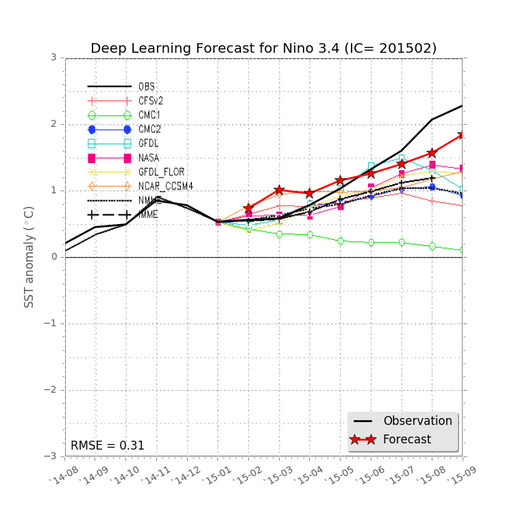

2017년 한국기상학회 추계학술대회

김동훈, 우승범 (인하대학교)

# 1. 서론

   인공신경망의 최신 기술인 딥러닝 방법 중에서 장기 시계열 예측에 적합한 GRU(Gated Recurrent Unit) 순환신경망(Recurrent Neural Networks, RNN)을 사용하여 Nino 3.4 지역의 SSTA(Sea Surface Temperature Anomaly, 해수면온도 이상)를 매월 단위로 미래 8개월까지 예측하는 시스템을 개발하였다.  이 시스템 개발에 앞서서 “인공신경망 딥러닝을 이용한 엘니뇨 예측성 연구”라는 주제로 지난 2017년 4월에 한국해양학회 춘계학술대회에서 선행연구 결과를 제시하여 그 가능성을 소개한 바 있다. 당시에 올 8월까지의 예측자료를 소개한 바가 있으며, 현재까지 입수한 관측자료와 비교한 자료를 그림 1에 제시하였다. 그림에서 보이는 바와 같이 선행연구로 이루어진 엘니뇨 예측시스템의 성능이 고무적인 것을 알 수 있다.

그림 1.  2017년 3월에 모의한 Nino 3.4 지역 SSTA 예측 결과. 20년간의 학습자료로 구축한 모델(t20)의 예측 평균제곱오차가 0.05도로 높은 성능을 나타내고 있다. 

   본 연구에서는 예측인자로써 SST만을 사용한 기존 모델을 개선하여 해양 수심 20미터의 해수온을 추가하고 예측방법 등을 개선하여 딥러닝 방법의 엘니뇨 예측시스템을 개발하였다.

# 2. 예측방법 및 자료

   인공신경망(Neural Networks, NN)은 인공지능 기계학습 기술 중에서 신경모형 패러다임에 속하며 그 중에서도 신경망을 깊게 구성한 것을 심층신경망(Deep NN, DNN)이라고 부른다. 최근의 심층신경망은 새로운 패러다임을 맞이하여 딥러닝(Deep Learning)이라는 새로운 신조어로 불리우는데, 그 방법에 따라서 합성곱신경망(Convolutional NN, CNN)과 순환신경망(Recurrent NN, RNN), 심층신뢰망(Deep Belief Network, DBN) 등으로 나누어 지며, CNN과 RNN은 지도학습(supervised learning)으로, DBN은 비지도학습(unsupervised learning)으로 분류된다. 또한, CNN과 DBN은 이미지 인식과 같은 독립자료의 처리에 적합하며, RNN은 언어 인식과 같이 자료의 순서가 판단에 필요한 시계열 자료의 처리에 적합하다.  따라서 시계열의 연속성을 고려하기 위하여 본 연구에서는 RNN의 방법을 사용하였으며, 특히 RNN의 방법 중에서 장기 기억을 잘 반영할 수 있는 GRU 방법을 사용하였다. 사용된 도구는 알파고를 개발한 구글로부터 개방형으로 제공하는 딥러닝 라이브러리인 Tensorflow를 사용하였다.  RNN-GRU는 입력층과 은닉(hidden)층, 출력층으로 구성되는데 입력층에 필요한 입력자료는 전지구 월별 시계열 (1979년 1월 – 2017년 6월, 38년 6개월간) 기간에 대하여 엘니뇨와 관계가 깊을 것으로 판단되는 ECMWF 재분석 자료인 ERA-Interim 자료 중 SST와  GODAS(NCEP Global Ocean Data Assimilation System)의 수심 20m에서의 해수온(T20m)을 위경도 방향으로 20도씩 bin으로 나누어 사용하였다. 각 bin은 육지가 10% 이상 포함되어 있는 지역을 제외한 63개의 분할지역에 대하여 지역 평균 시계열 자료로 구성하였다.  이 전 연구에서는 입력층으로 전지구 주요 해역을 북태평양과 적도태평양, 동아시아, 대서양, 인도양 등의 5개 지역으로 나누어 각 지역에 대하여 EOF 분석에 의해 도출된 주요모드 시계열자료를 사용하였었는데, 2015년 후반기와 같은 엘니뇨가 강했던 해는 예측성이 떨어졌으며 그 원인은 원 자료를 2차로 가공하면서 딥러닝 모델의 예측성능을 떨어뜨리는 것으로 판단되었다. 출력자료로 사용되는 Nino 3.4 지역의 SSTA는 OISST(version 2)와 ERSST (version 4), HadISST 등의 기관에서 제공하고 있는데 자료 제공 기간과 자료의 품질이 조금씩 차이를 보이고 있다. 각 자료를 비교 분석해 본 결과, 본 연구의 예측 자료 비교에 주로 사용한 NCEP CPC에서 사용한 SSTA와 가장 유사한 것이 OISST 자료인 것으로 판단되어 이를 출력층 자료로 사용하였다.  본 실험에서 예측한 기간은 지난 3년간(2015년~2017년6월)으로 매월마다 예측을 하였으며 각 예측에 대하여 미래 8개월까지 예측을 하였다. 예측 기간과 입력 자료들의 불일치 기간을 제외한 1980년부터 2014년까지의 35년간 자료를 딥러닝 모델의 학습에 사용하였으며, 한번 예측에 미래 8개월을 동시에 예측하도록 many-to-many 방법을 사용 하였다. 

# 3. 결과

매월 단위로 미래 8개월을 예측하는 방법으로 지난 3년간에 대하여 관측치와 예측치를 비교하여 보았다 (그림 2).

그림 2. Nino 3.4 SST Anomaly 시계열. 관측치: 검은 실선, 예측치 평균: 붉은 실선

검은 실선은 OISST에서 제공하는 관측치이며, 매월마다 그려진 짧은 실선과 점들은 각 달의 8개월 예측을 나타낸다. 그러므로 해당 월에는 지난 8개월동안 예측한 8개의 예측치가 있으므로 이에 대한 앙상블 평균치를 붉은 실선으로 나타내었다. 2015년 2월~5월 사이에는 11월의 강한 anomaly의 trigger가 되는 시점으로, 많은 예측 모델들이 이에 대한 예측에 어려움을 겪었었는데, 딥러닝 모델에서는 이를 잘 모의한 것으로 나타났다. 좀 더 자세한 비교를 위하여 같은 기간에 대하여 미국 기상청(NCEP)의 기후예측센터(CPC)에서 제공하는 유수 연구소들의 예측결과들과 비교해 보았다 (그림 3).

<table style="border:0; text-align: center;">
  <tr>
    <td></td>
    <td></td>
  </tr>
  <tr>
    <td></td>
    <td></td>
  </tr>
  <tr><td colspan="2">그림 3. NCEP CPC에서 제공하는 모델별 앙상블 예측결과들과 딥러닝 모델의 예측결과 
    (검은실선: 관측치, 붉은별표실선: 딥러닝예측결과의 앙상블평균) 
    예측시점 : 2015년2월(좌상), 2015년8월(우상), 2016년11월(좌하), 2017년6월(우하)</td></tr>
</table>

# 4. 결론

본 연구에서는 딥러닝을 이용한 해수면 온도 예측 시스템을 개발하였으며, 이를 이용하여 과거 38년간의 관측 재분석 자료를 기반으로 RNN-GRU 방법으로 Nino 3.4 지역의 해수면 온도 이상을 정량적으로 예측해 보았다. 학습된 모형으로 지난 3년간(2015년1월~2017년6월)에 대하여 수행한 예측 결과들은 선진국의 예측결과들과 비교할 수 있을 정도의 높은 성능을 보여 주고 있으며 실 사용에 바로 사용할 수 있을 정도의 완성도를 보여 주고 있다. 지난 3월에 예측한 올해 8월까지의 예측결과가 실측치와 상당히 일치하고 있는 것과 같이, 이번 연구에서도 내년(2018년) 2월까지의 예측자료를 그림 3(오른쪽아래)에 제공하여 추후에 검증할 예정이다.

---

=== END ===

---

---

