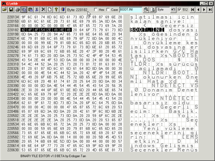
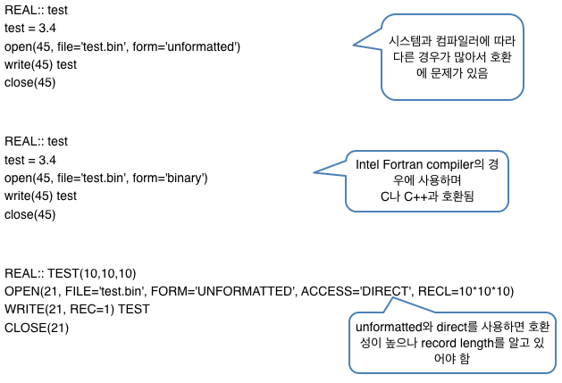
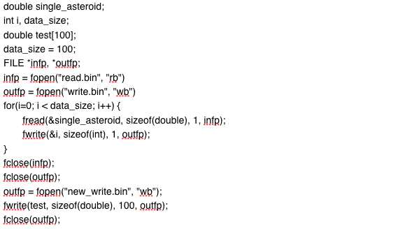
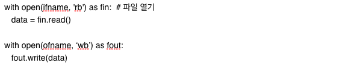
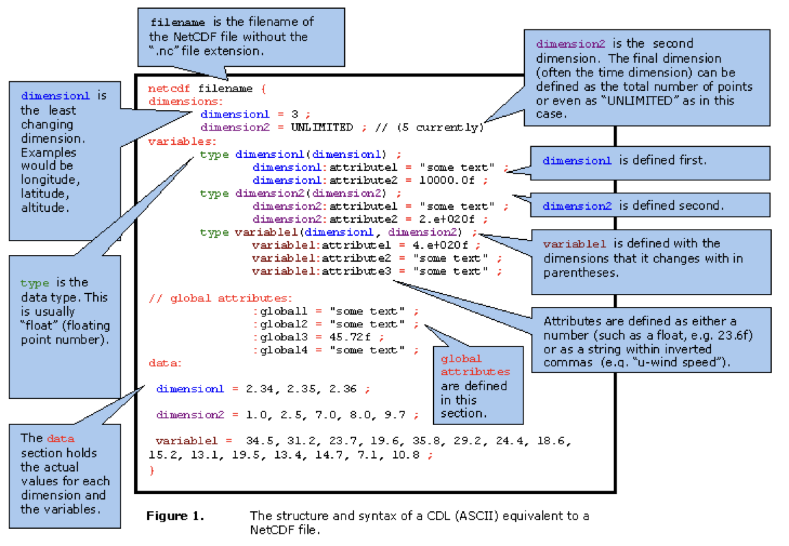
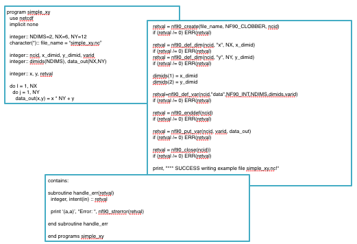
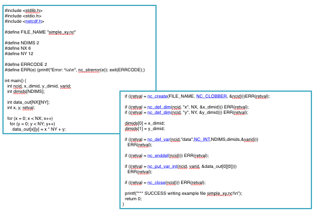
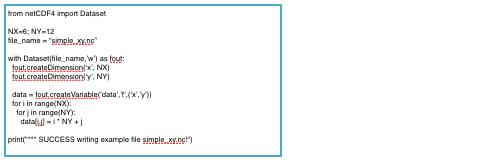

### Binary(이진) data

* 텍스트 파일: 인간 친화적 데이터
* 이진 파일: 컴퓨터 친화적 데이터
* NetCDF, Grib, HDF5 등 :<br>이진 파일의 일종으로 컴퓨터 친화적이지만, 인간 친화적이기도 함<br>


### Binary format data 읽고 쓰기

* Fortran: binary data 읽고 쓰기<br>

* C: binary data 읽고 쓰기<br>

* Python: binary data 읽고 쓰기<br>

---

### NetCDF 란?

[](../assets/images/DataFormat/nc_header.png)

---

### NetCDF 응용 프로그램들

* [CDAT (Climate Data Analysis Tool)](http://www.unidata.ucar.edu/software/netcdf/software.html#CDAT)
* [CDO (Climate Data Operators)](http://www.unidata.ucar.edu/software/netcdf/software.html#CDO)
* [CSIRO MATLAB/netCDF interface](http://www.unidata.ucar.edu/software/netcdf/software.html#CSIRO-MATLAB)
* [FERRET](http://www.unidata.ucar.edu/software/netcdf/software.html#FERRET)
* [GDAL (Geospatial Data Abstraction Library)](http://www.unidata.ucar.edu/software/netcdf/software.html#GDAL)
* [GMT (Generic Mapping Tools)](http://www.unidata.ucar.edu/software/netcdf/software.html#GMT)
* [GrADS (Grid Analysis and Display System)](http://www.unidata.ucar.edu/software/netcdf/software.html#GrADS)
* HDF (Hierarchical Data Format) interface
* [JSON format with the ncdump-json utility](http://www.unidata.ucar.edu/software/netcdf/software.html#JSON)
* [NCL (NCAR Command Language)](http://www.unidata.ucar.edu/software/netcdf/software.html#NCL)
* [NCO (NetCDF Operators)](http://www.unidata.ucar.edu/software/netcdf/software.html#NCO)
* [ncview](http://www.unidata.ucar.edu/software/netcdf/software.html#ncview)
* [OPeNDAP (formerly DODS)](http://www.unidata.ucar.edu/software/netcdf/software.html#OPeNDAP)
* [OpenDX (formerly IBM Data Explorer)](http://www.unidata.ucar.edu/software/netcdf/software.html#OpenDX)
* [Weather and Climate Toolkit (WCT)](http://www.unidata.ucar.edu/software/netcdf/software.html#WCT)
* [AVS](http://www.unidata.ucar.edu/software/netcdf/software.html#AVS)
* [IDL Interface](http://www.unidata.ucar.edu/software/netcdf/software.html#IDL)
* [MATLAB](http://www.unidata.ucar.edu/software/netcdf/software.html#MATLAB)
* …, …, …

---

### Sample NetCDF example

```json
netcdf simple_xy {
dimensions:
   x = 6 ;
   y = 12 ;
variables:
   int data(x, y) ;
data:
 data =
  0, 1, 2, 3, 4, 5, 6, 7, 8, 9, 10, 11,
  12, 13, 14, 15, 16, 17, 18, 19, 20, 21, 22, 23,
  24, 25, 26, 27, 28, 29, 30, 31, 32, 33, 34, 35,
  36, 37, 38, 39, 40, 41, 42, 43, 44, 45, 46, 47,
  48, 49, 50, 51, 52, 53, 54, 55, 56, 57, 58, 59,
  60, 61, 62, 63, 64, 65, 66, 67, 68, 69, 70, 71 ;
}
```


* Fortran: Simple NetCDF example<br>
* C: Simple NetCDF example<br>
* Python: Simple NetCDF example<br>
* 