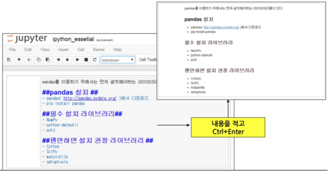
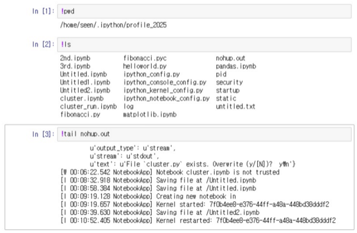

## Jupyter (IPython) Notebook

### Web browser based Python IDE

### Cell: Markdown

* Markdown language 기반으로 Document 작성 (Wikipedia 처럼 작성 방식)
* 코드에 대한 설명이 가능하다
* 수학수식 표현도 가능(Mathjax)

### Cell: Code

* 파이썬의 코드를 각 셀에 원하는 만큼을 작성하여 실행하면 메모리 상에 반영된다.
* 위, 아래 위치가 달라도 실행한 스텝 번호(`In` [번호])가 높을 수록 최근에 수행된 영역이다.

### 운영체제와 함께 사용하기

* Jupyter에서 운영체제의 자체 명령어를 실행하기 위해서는 **!(명령어)** 로 수행 

