## 원시방정식(Primitive Equation)

대기와 해양의 유체를 기술하는데 사용되는 방정식은 다음의 세가지가 있다.

* 연속방정식(continuity equation)
* <u>운동량 보존 방정식(momentum equation)</u>
* 열에너지 방정식(thermal energy equation)

### Navier-Stokes equations

N-S 방정식은 점성을 가진 유체의 운동을 기술하는 비선형 편미분 방정식이다. 이 방정식은 대기와 해양의 분석과 예측 등을 연구하는데 사용되고 있다. N-S 방정식은 여러가지 형태로 쓰이지만, [아인슈타인 표기법](https://ko.wikipedia.org/wiki/%EC%95%84%EC%9D%B8%EC%8A%88%ED%83%80%EC%9D%B8_%ED%91%9C%EA%B8%B0%EB%B2%95)을 사용하면 다음과 같다.

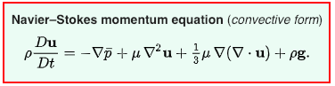

### The Primitive Equations in Cartesian Coordinates

* momentum equations 

  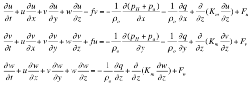

* continuity equation 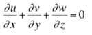

* temperature equation 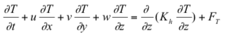

* salinity equation 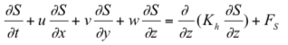

* density equation 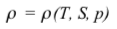

---

## 해양-기상 변수의 종류

해양과 기상 분야에서 사용되는 변수들은 scalar 자료와 vetor 자료로 구분할 수 있다.

* 지형자료 : 수심, 표고

  * ETOPO2: Topography and Bathymetry 

* Scalar : 기온(Temperature, $^oC$), 기압(Pressure, $hPa$), 습도(Humidity, relative, $\%$), 강수량($mm$), 수온($^oC$), 염분($o/_{oo},\  g/kg$), 등...

  * 수온(Ocean Temperature, Sea Temperature, Water Temperature) 

    <iframe src="https://youtube.com/embed/4d8TZDzNUmA/18.jpg" frameborder="1" allow="autoplay; encrypted-media" allowfullscreen></iframe>

    (2003년 작품: 김동훈)

  * 해수면 높이 (SSH, Sea Surface Height) 

    <iframe src="https://youtube.com/embed/TsJYgdqJD-E?t=12" frameborder="1" allow="autoplay; encrypted-media" allowfullscreen></iframe>

    (1996년 작품)

* Vector : 바람(Wind, $m/s$), 유속(Currents, $m/s$), 등 ...

  * 해수면 유속(Sea Surface Currents) 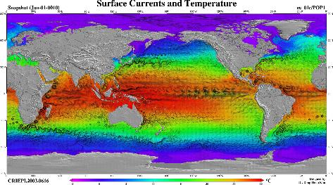(2003년 작품: 김동훈)

* Flux : 열속(heat flux), 담수속(fresh water flux), 단파(short wave radiation), 장파(long wave radiation)
  * 열속(heat flux) :  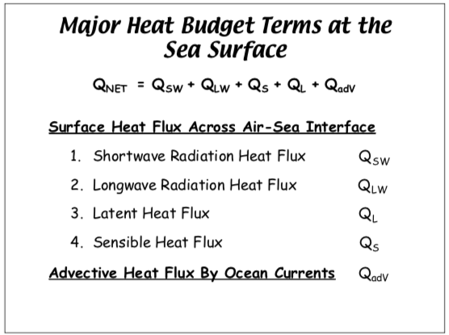
  * 담수속(fresh water flux) : Evapolation - Pricipitation [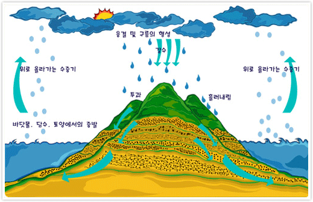](https://www.jeju.go.kr/files/editor/e26d259b-8289-4dd8-99f7-6bca92189e3a.gif)

---

## [해양-기상 자료 형태(형식, format)의 종류](/DataFormat/)

* text(ascii)
* binary
* bin + ctl
* grib & grib2
* hd5
* NetCDF
* ... ...

---

## 해양-기상 관측 기기들

* Remote Sensing
  * 인공위성
  * 레이더
  * 라이더
* Direct Sensing
  * 부이(Buoy) 
  * 프로파일러 : ADCP, CTD
  * 자동관측기기 : AWS

---

## 해양-기상 자료들

* [Argo](http://www.argo.ucsd.edu/)
* [GTSPP](http://www.nodc.noaa.gov/GTSPP/)
* [CCHDO](http://whpo.ucsd.edu/)
* [World Ocean Database](http://www.nodc.noaa.gov/OC5/WOD/pr_wod.html)
* [World Ocean Atlas](http://www.nodc.noaa.gov/OC5/WOA09/pr_woa09.html) : Monthly, seasonal and annual hydrographic data from the U.S.
  * 2001, 2005, 2009, 2013
* [World Ocean Circulation Experiment(WOCE)](https://www.nodc.noaa.gov/woce/) : Global $0.5^o \times 0.5^o$ gridded climatology
* [SeaDataNet](http://www.seadatanet.org/Data-Access/Common-Data-Index-CDI)
* [Medar/Medatlas](http://www.ifremer.fr/medar/)

---

## 해양-기상 자료 서비스

* PODAAC

  (Physical Oceanography Distributed Active Archive Center)

  [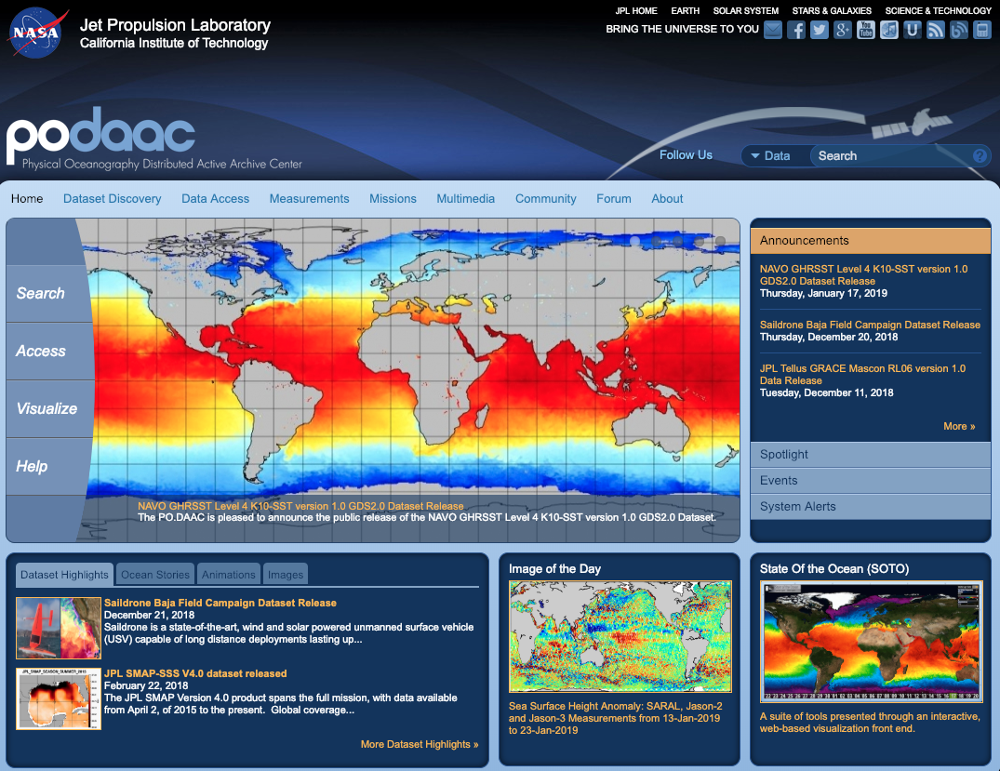](https://podaac.jpl.nasa.gov/)

---

## [해양-대기 자료의 처리 및 표출](/JuNo/)

* scalar

  * Contour

    중첩일기도 (고층일기도+적외영상)

    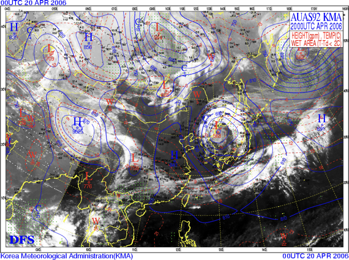 정지화면상에서 여러가지 성분을 함께 나타내기 좋음.

  * Color : 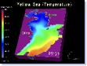

  * Surface

    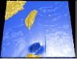 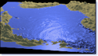 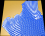 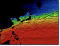

* vector

  * Arrow : 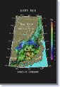

  * Tracer : 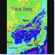

  * Streamline

    벡터성분의 움직임을 표현하기 좋지만 난이도 높음.

    * OpenDX : 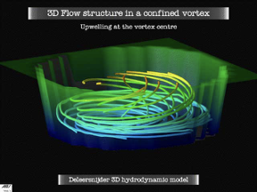
    * Maya : 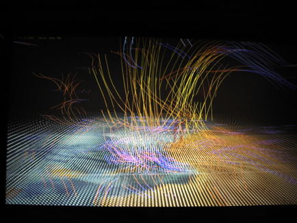

* Virtual Reality (Strereo Graphic)

  * Maya, NCSA

    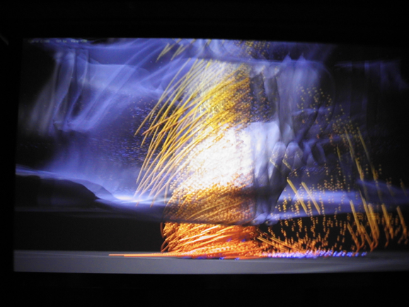 NCAS에서 제작한 예로써 realtime rendering은 아님.
