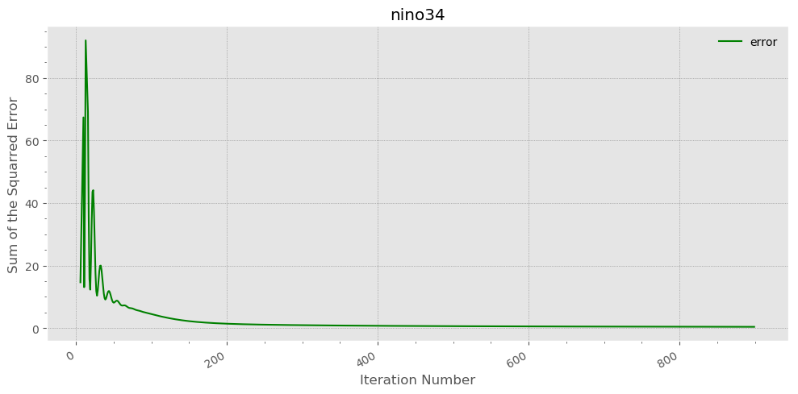

<p style="text-align:right">작성 : 김동훈 (<a href="http://blog.dhkim.info">http://blog.dhkim.info</a>, 인하대학교)<br/>2019년 6월 12일</p>

# 소 개

"**[인공신경망 딥러닝(Deep Learning)을 이용한 엘니뇨 예측성 연구](https://dhkim.tistory.com/280)**"를 2017년에 *한국해양학회*와 *한국기상학회*에 발표하면서 개발한 **N3nino** 모델의 사용법을 설명합니다. 

연구 결과의 자세한 내용은 제 홈페이지의 [여기](https://dhkim.tistory.com/280) 를 참고하시기 바랍니다. 이 모델이 개발된 후 2018년에 좀 더 완성된 모델의 결과를 학회에 발표하였으나 홈페이지에는 아직 게재하지 못하였으므로 한국해양학회와 한국기상학회의 학술발표 홈페이지에서 찾아보시면 됩니다.

N3nino 의 간단한 사용법은 다음 명령으로 알 수 있습니다.

```bash
cd n3nino.3ar/model
./rnnN3N.py --help
```


모델의 실제 사용 방법은 "N3nino/run.sh"를 참조하면 되며, 각 인자들에 대한 자세한 설명은 다음과 같습니다.

```bash
cd model
for lead in 1 2 3 4 5 6 7 8 # 1개월 후 부터 8개월 후까지 학습한 후 예측합니다.
do
  ./rnnN3N.py --verbose --plot --efcast="201706" --source="sst,t20m" --leads="[${lead},]" --cell="GRU" --num_steps=12 --num_layers=2 --num_hidden=100 --num_loop=900
done

#----------- 인자에 대한 설명 -----------------------------------------------------------------
(생략) --model ; RNN과 CNN을 선택할 수 있습니다. default=RNN
(생략) --code ; 모델의 종류. default=nino34
--leads=
(생략) --sfcast ; 예측 시작 년월. default=201401
--efcast="201706" ; 예측 끝 년월. default=today
(생략) --strain ; 학습 시작 년월. default=198001
(생략) --etrain ; 학습 끝 년월. default=201312
--num_loop=900 ; 학습 epochs의 수. default=900
--source="sst,t20m" ; 학습자료 변수들 (all, best, sst, msl, t20m). default=best
--cell="GRU" ; deep learning cell (BasicRNN,BasicLSTM,LSTM,phLSTM,GRU). default=GRU
(생략) --optimizer ; 최적화 함수. default=Adam
--num_hidden=504 ; hidden cell의 갯수. default=100
--num_layers=2 ; hidden layer의 갯수. default=2
--num_steps=12 ; 단위 학습 자료의 길이 (단위: 월). default=12
(생략) --learning_rate ; 학습 learning rate. default=0.001
(생략) --keep_prob ; overfitting을 방지하기 위한 dropout. default=1.0 (no dropout)
(생략) --forget_bias ; the forget bias. default=0.0
(생략) --init ; 학습 초기화. 이전 학습 자료를 사용하지 않음. default=False
--train ; 모델의 학습 실행 및 학습 내용 저장. 인자로 주어지면 True 임. default=False
--save ; save 디렉토리에 결과 저장. 인자로 주어지면 True 임. default=False
(생략) --restore_date ; 기존 학습 내용을 읽어와서 심화 학습할 경우의 날짜
(생략) --savedir ; 결과 저장 폴더. default='../save'
(생략) --workdir ; 작업 폴더. default='../work'
(생략) --datadir ; 학습자료 폴더. default='./data'
--plot ; 결과를 바로 그려 볼 때
(생략) --disploy_step ; 결과 표시 간격. default=50
(생략) --verbose ; 출력 메세지를 상세하게 표시할때
```

학습과 예측 과정 중에 나오는 메세지의 한 예는 다음과 같습니다.


학습 후에 예측된 결과들은 "N3nino/work" 를 보시면 됩니다.<br/>다음은 예측된 결과들 중의 일부를 보여 줍니다.

<br/>nino3.4 지역의 1개월 후 예측 (검정실선: 관측, 파란실선: 예측)

<br/>learning cost value

