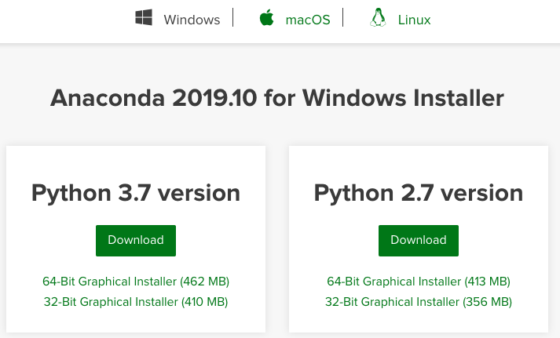
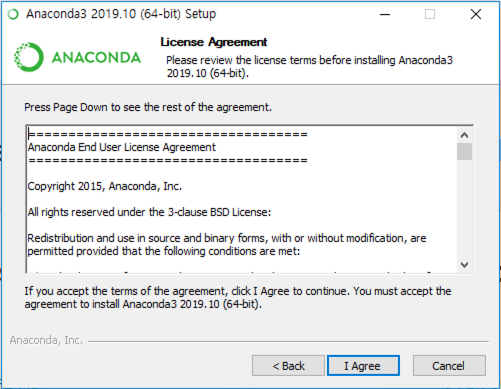
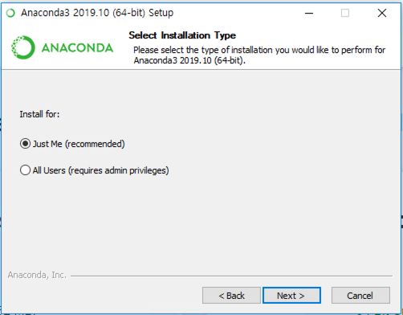
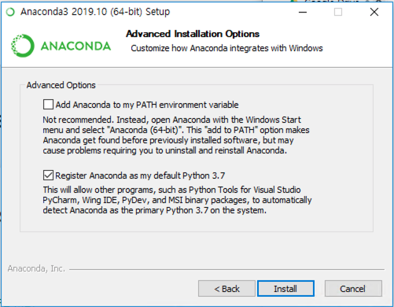
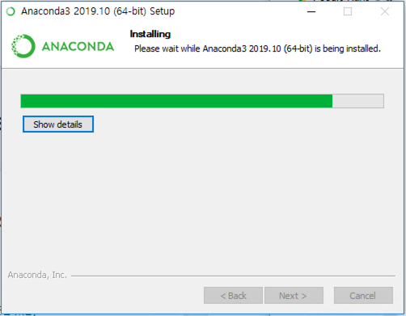
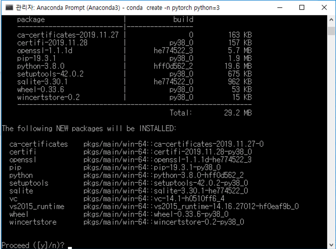
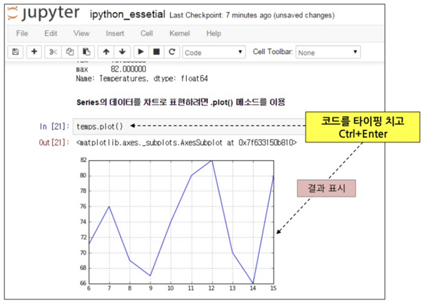
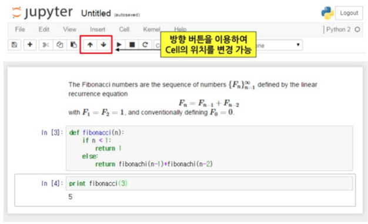
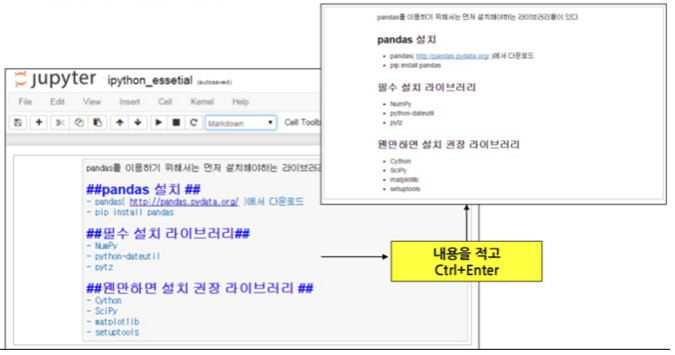
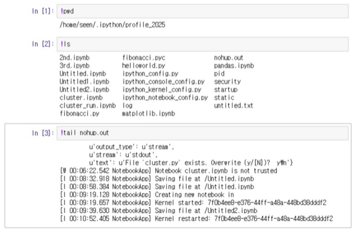

## 0. Jupyter 환경의 PyTorch 개발 환경 갖추기 순서

Jupyter 환경의 PyTorch 개발 환경을 갖추기 위해서는 다음과 같은 순서로 관련 프로그램과 패키지를 설치하여야 합니다.

1. Anaconda 설치
2. PyTorch 설치
3. Jupyter 실행

## 1. Anaconda 설치

[Anaconda](https://www.anaconda.com/) 는 수학과 과학 분야에서 사용되는 여러 패키지들을 묶어 놓은 파이썬 배포판으로써, 유명한 Numpy, SciPy, Pandas, Matplotlib 등을 비롯한 많은 패키지들을 기본적으로 포함하고 있습니다.<br/>
Anaconda는 특히 최근에 데이타 사이언스와 머신 러닝 분야에서 파이썬을 사용하기 위해 기본적으로 설치하는 배포판이 되었습니다.

Anaconda는 수백가지의 패키지를 기본적으로 제공하고 있으므로 용량이 크기 때문에 사용자 컴퓨터의 자원이 많지 않거나 꼭 필요한 패키지만을 원하는 사용자는 [Miniconda](https://docs.conda.io/en/latest/miniconda.html) 를 설치하면 됩니다.<br/>
Miniconda는 기본적으로 제공되는 패키지가 적은 만큼 사용자가 필요한 패키지를 수동으로 설치해주어야 하는 경우가 많지만, 필요한 패키지만을 깔끔하게 관리하고자 하는 사용자들이 많이 사용하고 있습니다.


### 1-1. Anaconda 다운로드

Anaconda를 설치하기 위해서는 https://www.anaconda.com/ 웹사이트에서 자신의 OS에 맞는 프로그램을 다운받아서 설치하면 됩니다. 여기에서는 Windows 10을 기준으로 설명하지만, 처음 설치과정 외에는 리눅스나 맥킨토시 환경에서도 동일하게 적용할 수 있습니다.

Anaconda 다운로드 페이지(https://www.anaconda.com/distribution/) 에서 OS에 맞는 설치 파일을 내려받습니다. 현재 시점(2019년 12월)에서  anaconda의 최신 버전은 2019.10 입니다.

<center></center>

파이썬은 2.x 버전과 3.x 버전으로 두 가지가 있는데, 파이썬 2.x 버전의 개발이 이미 중단됐으므로 3.x 버전을 추천합니다.


### 1-2. Anaconda 설치

내려받은 설치 파일(Anaconda3-2019.10-Windows-x86_64.exe)을 실행합니다.
첫 설치화면에서 "Next >"를 클릭하면 [**License Agreement**] 화면이 나오는데 "I Agree"를 클릭합니다.

<center></center>

<br/>[**Select Installation Type**] 화면은 설치 유형을 선택하는 화면입니다. Anaconda 측에서는 현재 사용자 영역에만 설치하는 옵션을 추천한다. 모든 사용자 옵션은 관리자 권한을 가진 사용자의 경우에 선택하면 됩니다. 여기에서는 [Just Me (recommended)]를 선택하고 "Next >"를 클릭합니다.<br/>
[**Choose Install Location**] 화면은 설치할 경로를 지정하는 화면입니다. "Destination Folder"에 설치할 디렉토리 위치를 지정하고 "Next >"를 클릭합니다.

<center></center>

<br/>[**Advanced Installation Options**] 화면은 추가 설치 옵션을 선택하는 화면입니다. Anaconda의 설치 위치를 환경변수에 추가하고, 기본 파이썬 인터프리터로 현재 설치한 환경을 사용하게 설정해줍니다. 다른 버전의 Anaconda 가 설치되어 있지 않다면 "Add Anaconda to my PATH environment variable"와 "Register Anaconda as my default Python 3.7"를 모두 체크하고 "Install"을 클릭합니다.

<center></center>

[**Installing**] 화면에서 진행과정을 보여 주면서 Anaconda의 전체 패키지가 설치됩니다.<br/>

### 1-3. Python 가상 환경 (Vitural Environment) 설치

Anaconda 설치가 끝나면 바탕화면의 윈도우 아이콘을 눌러 프로그램 목록에서 [**Anaconda Prompt**]를 클릭합니다.<br/>
지금부터는 윈도우나 맥킨토시, 리눅스에서도 동일한 과정으로 수행할 수 있습니다.

여기에서는  Python 가상 환경 설치, 각종 라이브러리 설치, 스크립트 실행 등의 작업을 진행할 것입니다.<br/>
Python의 가상 환경이란, 말 그대로 가상의 개발 환경을 만들어 주는 것입니다.<br/>
Python은 버전에 따라서 사용되는 패키지들의 호환성이 다르고, 패키지 간에 충돌할 가능성이 있으므로 Anaconda에서는 사용자 환경마다 독립적인 가상 환경을 만들어서 독립성을 보장하는 도구를 제공합니다. 또한 가상환경 상에서는 사용자가 필요한 패키지만을 설치하여 불필요한 패키지가 설치되는 것을 막을 수 있습니다. 이러한 이유들로 프로젝트 별로 각각의 가상환경을 만들고 이 환경에서 개발하는 것이 바람직합니다.

여기에서는 "pytorch"라는 이름으로 가상환경을 만들도록 하겠습니다.

```bash
conda create -n pytorch python=3.7
```

"-n" 옵션의 다음에 적는 이름은 만들어줄 가상환경의 이름이고, "python=3.7" 은 python의 버전을 3.7로 사용하겠다는 의미 입니다. 현재는 python이 v3.8 까지 제공되고 있지만, PyTorch가 python v3.7 까지 지원하고 있으므로 이에 맞게 설치해 줍니다. 이를 실행 시키면 "Proceed ([y]/n)?" 이라는 메세지가 나오는데 "y"를 입력하고 엔터를 칩니다. 

<center></center>

<br/>필요한 패키지가 자동으로 설치되고 나면, 다음의 명령으로 새로 만든 가상환경을 활성화 또는 비활성화 할 수 있습니다.

```bash
(base) path> conda activate pytorch # 가상환경 활성화
(pytorch) path> conda deactivate    # 가상환경 비활성화
(base) path> 
```

"conda activate pytorch" 는 만들어준 "pytorch" 라는 이름의 가상환경을 활성화 하는 명령이고,<br/>"conda deactivate" 는 활성화된 가상환경을 나와서 원래대로 돌아가는 명령입니다. 명령을 수행할 때마다 프롬프트의 맨 앞의 내용이 바뀌는 것을 알 수 있습니다.<br/>


## 2. PyTorch 및 관련 라이브러리들 설치

Anaconda 에서는 각 종 패키지와 라이브더리들을 손 쉽게 설치할 수 있는 도구를 제공합니다. PyTorch도 다음의 명령으로 간단하게 설치할 수 있습니다. 사용자의 시스템에 장착되어 있는 NVIDIA의 그래픽 카드 사용 유무에 따라서 알맞은 명령을 실행하여 설치합니다.

```bash
(base) path> conda activate pytorch

# NVIDIA의 그래픽 카드가 장착된 시스템에서 GPU를 사용하고자 할 경우:
(pytorch) path> conda install pytorch torchvision cudatoolkit=10.1 -c pytorch

# CPU 만을 사용하고자 할 경우:
(pytorch) path> conda install pytorch torchvision cpuonly -c pytorch
```

<br/>이 외에 python에서 자주 사용되는 jupyter와 pandas, matplotlib 등의 라이브러리를 다음과 같이 설치합니다.

```bash
(pytorch) path> conda install jupyter pandas matplotlib
```

<br/>이제 모든 필요한 패키지와 라이브러리들을 설치하였습니다.<br/>
시스템에 현재 구성되어 있는 가상환경의 종류와 가상환경 내에서 설치된 패키지의 종류와 버전들의 정보는 다음과 같은 명령으로 알아 볼 수 있습니다.

```bash
(pytorch) path> conda info --envs # 설치된 가상환경에 대한 정보
# conda environments:
#
base                     D:\Users\user\Anaconda3
pytorch               *  D:\Users\user\Anaconda3/envs/pytorch

(pytorch) path> conda list        # 현재 가상환경에서 설치된 패키지들의 이름과 버전 정보
# packages in environment at D:\Users\user\Anaconda3:
#
# Name                    Version                   Build  Channel
_ipyw_jlab_nb_ext_conf    0.1.0                    py37_0
alabaster                 0.7.12                   py37_0
anaconda                  2019.10                  py37_0
```

<br/>

## 3. Jupyter (IPython) Notebook 또는 Lab 실행

Jupyter Notebook 또는 Lab 은 오픈소스 웹 애플리케이션으로 라이브 코드, 등식, 시각화와 설명을 위한 텍스트 등을 포함한 문서를 만들고 공유하도록 할 수 있습니다. 주로 데이터 클리닝과 변형, 수치 시뮬레이션, 통계 모델링, 머신 러닝 등에 사용할 수 있습니다.

Python, R, Julia, Scala 등 데이터 과학 분야에서 인기있는 40종의 다양한 프로그래밍 언어를 지원합니다. 또한, 이메일과 드롭박스, 깃허브 등으로 공유할 수 있습니다. 가장 큰 장점은 실시간으로 인터렉티브하게 데이터를 조작하고 시각화 할 수 있도록 해 준다는 것입니다.

"ipython notebook"의 영감을 얻어 개발된 "jupyter notebook"은 어디에서나 웹 브라우저만 있으면 개발을 할 수 있다는 매력적인 기능 때문에 개발자들에게 선풍적인 인기를 얻었습니다. 그러나 하나의 창에 하나의 프로그램만을 편집해야 하는 불편함이 있어서 차세대 웹기반 사용자 인터페이스를 사용한 "jupyter lab"이 추가적으로 개발되었습니다. 현재는 두 가지 버전이 모두 사용가능하며 사용자의 취향에 따라서 선택하여 사용하면 됩니다.<br/>

### 3-1. Jupyter Nobetbook 또는 Lab 시작

Anaconda Prompt 터미널에서 다음과 같이 실행하면 서버가 실행되면서 자동적으로 explorer가 실행됩니다. 

```bash
(base) path> conda activate pytorch
(pytorch) path> jupyter notebook   # jupyter notebook 으로 실행할 경우
(pytorch) path> jupyter lab        # jupyter lab 으로 실행할 경우
```


### 3-2. Web browser based Python IDE

<center></center>

Jupyter notebook 또는 lab 의 web browser 화면에서 사용자가 편집할 수 있는 각각의 박스를 "**cell**" 이라고 합니다. "cell"은 세 가지 종류로 바꾸어 편집할 수 있습니다. "Code"와 "Markdown", "Raw"가 그것 입니다.

#### Cell: Code

* 파이썬의 코드를 각 셀에 원하는 만큼을 작성하여 실행하면 메모리 상에 반영된다.
* 위, 아래 위치가 달라도 실행한 스텝 번호(`In` [<span style="color:red;">번호</span>])가 높을 수록 최근에 수행된 영역이다.



<br/>

#### Cell: Markdown

* Markdown language 기반으로 Document 작성 (Wikipedia 처럼 작성 방식)
* 코드에 대한 설명이 가능하다
* 수학수식 표현도 가능(Mathjax)



<br/>

#### Cell: Raw

형식이 없는 Plain text 형식으로 보이는 셀 입니다. 실행하지 않는 코드나 메모 용도로 사용합니다. 


### 3-3. 운영체제와 함께 사용하기

* <span style="color:cyan;">Jupyter에서 운영체제의 자체 명령어</span>를 실행하기 위해서는 **<span style="color:red; border:true;">!(명령어)</span>** 로 수행합니다.



------

<center>- END -</center>
------

<br/><br/>

<br/>